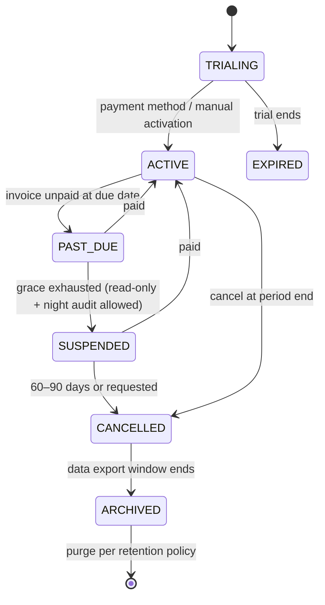
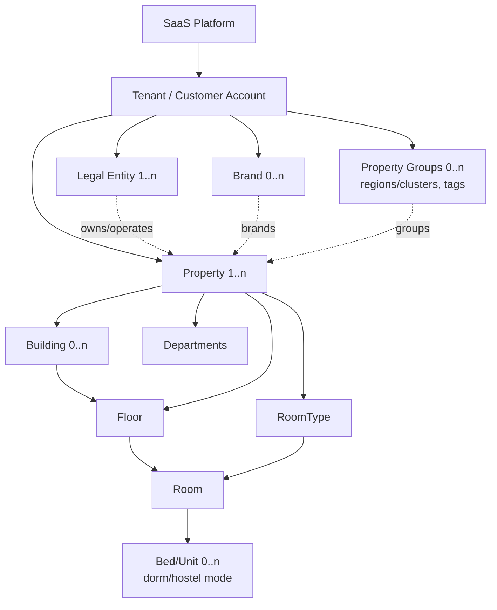

# 01 — Product, Business Model, Hierarchy, Personas, RBAC, Module Map
Covers deliverables **A–F** (checklist items 1–8).

---

## A. Product Vision

### A.1 Executive Product Definition
A cloud **Hospitality Operating System**: a multi-tenant, multi-property PMS at its core, growing into CRS, booking engine, channel manager, corporate portal, guest/staff apps, finance sub-ledger and revenue tooling. **The core promise: a 6-room guesthouse in Lahore and a 20-property group in Karachi run on the same platform, with the same data integrity guarantees, differing only in configuration and entitlements.**

### A.2 Positioning
| Segment | Their reality (Pakistan) | What wins |
|---|---|---|
| 5–20 room guesthouses/B&Bs | Excel/WhatsApp/paper, cash-heavy, one owner-operator, unstable power/internet, low willingness to pay | 30-minute self-serve setup, mobile-friendly, WhatsApp-native, cash control, low PKR price |
| 20–100 room hotels | Legacy local PMS or cracked/foreign software, corporate clients on credit, OTA reliance | Corporate AR, night audit, tape chart speed, housekeeping, tax-compliant invoices, channel manager (Phase 2) |
| 100–250 room / groups | Opera/Cloudbeds/Hotelogix-class, heavy corporate + groups, multiple properties | CRS, group blocks, roles/controls, consolidated reporting, integrations |

### A.3 Product principles
1. **Integrity before features** — inventory, folio, payment, night audit, tenant isolation are mission-critical (server + DB enforced).
2. **The hotel keeps operating** — no third-party outage may stop check-in/out; degrade gracefully (D-17).
3. **Speed for the front desk** — keyboard-first, ≤3 clicks for common actions, no modal chains.
4. **Configuration over code** — tax, plans, statuses' labels, services, policies are data (but state machines are code).
5. **Localisation without localisation lock-in** — Pakistan defaults shipped as *configuration packs* (`jurisdiction_pack: PK`), never hardcoded in core.
6. **AI assists, never decides** truth (rates, availability, ledger).

### A.4 Where the brief should be challenged (summary — detail in 00-index)
Reservation states, Booking.com-class OTA in MVP, native guest app in MVP, offline scope, "room status" combinatorics, corporate AR vs guest folio, tax hardcoding, WhatsApp API prerequisites. See `00-index.md §Challenges`.

---

## B. Commercial SaaS Model

### B.1 Revenue streams
1. **Subscription** (per property, banded by active rooms, plus module add-ons).
2. **Usage/pass-through**: SMS, WhatsApp conversations, e-signature, storage beyond quota.
3. **Payments**: optional take-rate/markup on online payments (booking engine, pre-check-in payment links) once gateway partnerships exist.
4. **Booking-engine commission** (optional alternative to fixed fee; attractive to small properties).
5. **Channel-manager fee** per connected channel/property.
6. **Premium integrations**: smart-locks, ERP connectors, POS connectors.
7. **Implementation/training services** (one-time; important in Pakistan for adoption).

### B.2 Pricing configuration model (nothing hardcoded)
```
SubscriptionPlan ──< PlanPriceTier (dimension=ACTIVE_ROOMS, from=1,to=20, price, currency, cycle)
       │         ──< PlanFeature (feature_key, included bool | limit int)
       │         ──< PlanUsageAllowance (metric_key, included_qty, overage_unit_price)
Subscription (tenant_id, plan_id, status, cycle, current_period_start/end, trial_end, cancel_at)
       ├──< SubscriptionItem (property_id?, addon_id?, quantity, unit_price snapshot)
       ├──< SubscriptionFeature (override per tenant: enterprise deals)
       └──< UsageRecord (metric_key, property_id, quantity, occurred_at)  -- append-only
AddOn (key, price model: flat | per_property | per_room | metered)
BillingCycle (MONTHLY | QUARTERLY | ANNUAL, discount_pct)
PlatformInvoice / PlatformInvoiceLine / PlatformPayment / CreditNote  -- separate ledger from hotel folios
```
- Plans are **versioned**; a subscription pins a plan *version* (grandfathering).
- Currency per plan (PKR default); tax on SaaS invoices from the platform's own tax config.
- Illustrative default bands (configurable): 1–20, 21–50, 51–100, 101–250, 250+. **Price points are a stakeholder/market decision (see AV).**

### B.3 Entitlement calculation from active inventory
- **Billable rooms** = rooms with `status = ACTIVE` and `sellable = true`, per property, snapshotted daily (`room_count_snapshot`).
- Billing policy options (configurable per plan): *peak in period*, *average*, *end-of-period*, *snapshot at renewal*. **Recommendation: peak-of-period with 3-day grace**, so a property cannot game the tier by deleting rooms before billing, but temporary OOO rooms do not count against it (only ACTIVE rooms count; OOO is a status of an ACTIVE room).
- Adding rooms beyond the tier ⇒ soft warning → tier upgrade prompt (prorated). Adding a property requires plan entitlement `max_properties`.
- Hard limits (users, properties) block creation; soft limits (rooms) warn and bill.
- **Downgrade** takes effect next cycle; feature loss must not orphan data (data retained read-only).

### B.4 Subscription lifecycle

Key rule: **suspension never blocks check-out, payment collection, or night audit** (hotel has in-house guests).

### B.5 Commercial risks / opportunities
- Pakistani SMB willingness to pay is low and payment collection is manual (bank transfer, cheque). Plan for **manual invoice + payment recording** in MVP; automated billing when a local gateway is integrated.
- Annual prepay discount improves cash flow. Local distributor/reseller model likely; support `reseller` on tenant (Phase 2) — keep `tenant.referred_by` field now.

---

## C. Tenant / Organization / Property Hierarchy



### C.1 Ownership rules (design decisions)
| Relationship | Cardinality | Notes |
|---|---|---|
| Tenant → Legal Entity | 1..n | Legal entity holds NTN/STRN, invoice series, bank accounts, tax registrations |
| Property → Legal Entity | exactly 1 **at a time** (effective-dated) | Ownership changes/leases happen; invoices reference the entity valid at posting date |
| Property → Brand | 0..1 | Brand controls defaults (templates, policies), not data ownership |
| Property ↔ Property Group | many-to-many | Flexible regional/portfolio reporting; **not** a rigid tree |
| Building → Floor → Room | Building optional | Floor may hang directly off Property (guesthouse) |
| Room → Bed/Unit | 0..n | `sellable_mode = WHOLE_ROOM | PER_BED`; PER_BED sales are Phase 3, model reserved |
| Guest | **Tenant-scoped** | One profile across the tenant's properties; *never* shared across tenants |
| Company (corporate) | **Tenant-scoped** | Same real company at two tenants = two records (isolation) |
| Global guest account (Guest App) | Platform-level *identity* only | Identity (login/phone) is platform-scoped; **guest profile data is tenant-scoped**, linked by `guest_identity_link` with explicit consent. Cross-hotel "one account" shows only the guest's own data per tenant. |

### C.2 Scope levels used by authorization
`PLATFORM` → `TENANT` → `LEGAL_ENTITY` → `PROPERTY` → `DEPARTMENT`. A role assignment = `(user, role, scope_type, scope_id)`; a user can hold many.

### C.3 Row ownership standard
- All tenant rows: `tenant_id`.
- Property-operational rows additionally: `property_id`.
- Financial documents additionally: `legal_entity_id`.
- Created/updated by, timestamps, `version` (optimistic lock), soft-delete only for master data (never for financial rows).

---

## D. Personas

| # | Persona | Realm | Primary goals | Pain today | Key screens |
|---|---|---|---|---|---|
| 1 | **Owner-operator (guesthouse)** | Tenant | Fill rooms, know cash, avoid leakage | Notebook, WhatsApp, distrust of staff | Dashboard, rack, cash report, mobile |
| 2 | **General Manager** | Property | Occupancy/ADR, control discounts, staff accountability | Late reports, unauthorised comps | Dashboard, approvals, audit |
| 3 | **Front Desk Agent** | Property | Fast check-in/out, walk-ins, no errors | Slow software, many clicks, ID scanning | Rack, check-in, folio |
| 4 | **Reservation Agent / CRA** | Property/Tenant | Quote & book quickly across properties | Switching systems | Availability search, reservation |
| 5 | **Night Auditor** | Property | Clean audit without stress | Manual reconciliation | Night Audit wizard |
| 6 | **Accountant/Finance Controller** | Property/Tenant | Accurate ledgers, tax filings, AR aging | Re-keying to Excel/QuickBooks | Folios, AR, tax reports |
| 7 | **Cashier** | Property | Shift balance | Variance disputes | Cashier session |
| 8 | **Housekeeping Manager / Housekeeper** | Property | Room readiness, assignments | Paper slips, phone calls, low-literacy users | Board, mobile app (icon-driven, Urdu later) |
| 9 | **Maintenance Manager/Tech** | Property | Fix quickly, OOO tracking | Lost requests | Tickets, mobile |
| 10 | **Sales Manager / Corporate Sales** | Property/Tenant | Win/keep corporate accounts | Contract terms in files | Corporate accounts, production |
| 11 | **Revenue Manager** | Tenant | Right price, restrictions | Spreadsheets | Rate calendar, pace |
| 12 | **Corporate Travel Coordinator / Approver / Traveler** | Corporate | Book, approve, reconcile invoices | Emailing hotels | Corporate portal |
| 13 | **Guest (leisure/business/foreign)** | Guest | Zero-wait check-in, transparent bill | Queues, repeated paperwork | Pre-check-in, guest web/app |
| 14 | **Platform Admin / Support / Implementation** | Platform | Onboard, support, bill | Fragile tooling | Back office |
| 15 | **Group Owner / Regional Manager** | Tenant | Portfolio view, comparison | Consolidation pain | Group dashboard |

---

## E. Roles & Permission Model

### E.1 Model
- **Permission** = `resource.action` (e.g., `folio.adjust`, `reservation.override_rate`). Registry in code; seeded to DB.
- **Role** = named set of permissions. **System roles** (below) are seeded and immutable; tenants can **clone/custom-create roles** (Professional+ plan).
- **Role assignment** scoped: `(user_id, role_id, scope_type, scope_id, valid_from, valid_to)`.
- **Limits (ABAC-lite)** on assignments: `max_discount_pct`, `max_discount_amount`, `max_refund_amount`, `max_adjustment_amount`, `can_approve_own = false`. Above limit ⇒ **approval request** to a role holding `*.approve`.
- **Sensitive actions** require **reason code**, are audited, and some require **step-up MFA**.
- **Segregation of duties** hard rules: creator ≠ approver; cashier cannot reconcile own variance; auditor role read-only; platform support cannot see PII without time-boxed customer-consented "support access" grant.
- Enforcement: NestJS guard → `AuthorizationService.can(actor, permission, resource{tenant, property, department})` on **every** endpoint (deny by default). Frontend uses permission list only for UI hints.

### E.2 Role catalogue
**Platform:** Super Admin, Sales, Customer Success, Support, Finance, Technical Support, Implementation Specialist, Read-only Auditor.
**Tenant/Group:** Group Owner, Group Administrator, Regional Manager, Finance Controller, Revenue Manager, Central Reservation Agent, Group Auditor.
**Property:** General Manager, Front Office Manager, Front Desk Agent, Reservation Agent, Night Auditor, Accountant, Cashier, Housekeeping Manager, Housekeeper, Maintenance Manager, Maintenance Staff, F&B Manager, Restaurant Cashier, Sales Manager, Corporate Sales, Concierge, Security, Read-only.
**Corporate:** Corporate Administrator, Travel Coordinator, Approver, Finance User, Traveler.
**Guest:** Guest.

*Additions recommended:* **Property Owner (absentee)** (read-only finance+dashboards, no ops), **Purchasing/Inventory** (Phase 3), **Cost Controller** (F&B, Phase 3), **API Client / Integration** (machine principal with scoped keys), **Support Impersonation** (special, time-boxed).

### E.3 Property-level permission matrix
Legend: **F** full (create/edit/delete where allowed) · **W** create/edit · **L** limited (own items / capped by limits) · **A** approve · **R** read · **–** none. "Sales" = Sales Mgr/Corporate Sales.

| Capability | GM | FOM | FDA | RSV | NA | ACC | CSH | HKM | HK | MTM | MT | FBM | RCS | SLS | CON | SEC | RO |
|---|---|---|---|---|---|---|---|---|---|---|---|---|---|---|---|---|---|
| Property setup / rooms / room types | F | R | – | R | – | – | – | R | – | R | – | – | – | R | – | – | R |
| Rate plans & rate calendar | F | W | R | R | – | R | – | – | – | – | – | – | – | W | – | – | R |
| Availability / restrictions / stop-sell | F | W | R | W | – | – | – | – | – | – | – | – | – | W | – | – | R |
| Create/modify reservation | F | F | W | W | L | – | – | – | – | – | – | – | – | W | L | – | R |
| Override rate / discount | A | A(L) | L | L | – | – | – | – | – | – | – | – | – | L | – | – | – |
| Cancel / no-show / reinstate | F | F | L | L | W | – | – | – | – | – | – | – | – | L | – | – | R |
| Room assignment / move / upgrade | F | F | W | W | – | – | – | R | – | – | – | – | – | – | W | – | R |
| Check-in / check-out | F | F | W | – | W | – | – | – | – | – | – | – | – | – | – | – | R |
| Guest profile (basic) | F | F | W | W | W | R | R | – | – | – | – | – | – | W | R | R | R |
| Guest ID documents / full CNIC view | F | W | W | – | W | – | – | – | – | – | – | – | – | – | – | R(L) | – |
| Folio view | F | F | W | R | W | F | W | – | – | – | – | R | L | R | – | – | R |
| Post charge | F | F | W | – | W | W | W | – | – | – | – | W | W | – | W | – | – |
| Folio adjust / reverse / transfer / split | A | A | L | – | L | W | – | – | – | – | – | – | – | – | – | – | – |
| Take payment | F | F | W | – | W | W | W | – | – | – | – | – | W | – | – | – | – |
| Refund | A | A | – | – | – | W | L | – | – | – | – | – | – | – | – | – | – |
| Cashier session open/close | F | F | W | – | W | R | W | – | – | – | – | – | W | – | – | – | – |
| Cashier variance review | A | A | – | – | – | A | – | – | – | – | – | – | – | – | – | – | R |
| Night audit run | A | W | – | – | F | W | – | – | – | – | – | – | – | – | – | – | R |
| Corporate accounts & contracts | F | R | R | R | – | W | – | – | – | – | – | – | – | F | R | – | R |
| Corporate AR (invoice/payment/credit) | A | – | – | – | – | F | – | – | – | – | – | – | – | R | – | – | R |
| Housekeeping board / assign | R | R | R | – | – | – | – | F | – | – | – | – | – | – | – | – | R |
| Update own HK tasks | – | – | – | – | – | – | – | W | L | – | – | – | – | – | – | – | – |
| Inspect room | – | W | – | – | – | – | – | W | – | – | – | – | – | – | – | – | – |
| Maintenance tickets / OOO blocks | A | W | W | – | W | – | – | W | W(create) | F | L | – | – | – | W | W | R |
| Services / service requests | F | W | W | – | – | – | – | W | – | W | – | W | – | – | F | – | R |
| F&B orders / room posting | F | W | – | – | – | – | – | – | – | – | – | F | W | – | – | – | R |
| Reports – operational | F | F | L | L | F | R | R | F | – | F | – | F | – | F | – | – | R |
| Reports – financial | F | R | – | – | F | F | R(L) | – | – | – | – | R | – | R | – | – | R |
| Users & role assignment (property) | F | – | – | – | – | – | – | – | – | – | – | – | – | – | – | – | – |
| Audit log view | F | R(L) | – | – | – | R | – | – | – | – | – | – | – | – | – | – | R |
| Channel mapping / sync | F | R | – | – | – | – | – | – | – | – | – | – | – | R | – | – | R |

### E.4 Tenant/Group-level matrix
| Capability | Group Owner | Group Admin | Regional Mgr | Finance Controller | Revenue Mgr | Central Res. Agent | Group Auditor |
|---|---|---|---|---|---|---|---|
| Tenant settings, legal entities, brands | F | F | R | R | – | – | R |
| Create properties / subscription view | F | F | – | R(billing) | – | – | R |
| Users & roles (all scopes) | F | F | W (region) | – | – | – | R |
| Cross-property dashboards/reports | F | F | F (region) | F | F | R(L) | F |
| Rates & restrictions (multi-property) | A | W | W | – | F | – | R |
| CRS search & booking any authorised property | R | W | W | – | – | F | – |
| Guest profile (tenant-wide) | F | W | R | R | R | W | R |
| Corporate contracts (group-wide) | F | W | R | W | – | R | R |
| Financial consolidation, AR aging | R | R | R | F | R | – | R |
| Audit log (tenant) | R | R | – | R | – | – | F |

### E.5 Platform matrix (excerpt)
| Capability | Super Admin | Sales | Cust. Success | Support | Finance | Tech Support | Implementation | Auditor |
|---|---|---|---|---|---|---|---|---|
| Create/suspend tenant | F | W (create) | W | – | W (suspend) | – | W (create) | R |
| Configure plans/pricing | F | R | R | – | W | – | – | R |
| Invoices/payments (platform) | F | R | R | – | F | – | – | R |
| View tenant business data | – | – | R(L)* | R(L)* | – | R(L)* | R(L)* | – |
| Impersonate/"support access" | F* | – | – | W* | – | W* | W* | – |
| Feature flags/system config | F | – | – | – | – | W | – | R |
| Platform audit log | F | – | – | – | – | – | – | F |
\* Only under a tenant-granted, time-boxed access grant; every read logged; PII masked by default.

### E.6 Corporate & guest scopes
| Capability | Corp Admin | Travel Coord. | Approver | Finance User | Traveler |
|---|---|---|---|---|---|
| Manage travelers/cost centers/policies | F | W | – | – | – |
| Create reservation (in contract) | F | F | – | – | request only / L |
| Approve requests | W | – | F | – | – |
| View/cancel per policy | F | W | R | R | own |
| Invoices, statements, spend reports | F | R | R | F | – |

Guest: manage own profile, reservations, pre-check-in, folio (own), payments, requests.

### E.7 Threat-driven RBAC notes
- "Permission escalation" test suite (mandated): role editing requires `role.manage`, cannot grant permissions you don't hold, cannot assign at broader scope than your own.
- Discount/refund/comps are limit-driven, not binary.
- Break-glass: GM-level emergency override with reason + immediate alert to owner.

---

## F. Complete Functional Module Map & Feature Inventory (with classification)

**Legend:** **M** = MVP must-have · **P2** = Phase 2 should-have · **P3** = Phase 3 advanced. Notes flag partial MVP scope.

### F.1 Platform foundation
| Feature | Tier | Notes |
|---|---|---|
| Multi-tenancy + RLS + isolation tests | M | |
| Tenant provisioning (back office) | M | manual/assisted |
| Legal entities, brands, property groups | M | groups/brands minimal UI |
| RBAC (scoped), custom roles | M | custom roles P2 |
| MFA (TOTP) for privileged roles; passkeys | M / P2 | |
| Audit log + data access log | M | |
| Feature entitlements | M | |
| Subscription plans/pricing config | M | invoices manual |
| Automated subscription billing/dunning | P2 | |
| Usage metering | P2 | model in M |
| Outbox/events/jobs infrastructure | M | |
| Notifications framework + email | M | |
| SMS provider | P2 | |
| WhatsApp: click-to-chat deep links | M | |
| WhatsApp Business API templates | P2 | needs BSP/Meta verification |
| Push notifications | P2 | |
| i18n framework (RTL-ready) | M | English UI only |
| Urdu UI (staff + guest) | P2 | |
| Arabic | P3 | |
| Public API + webhooks (outbound) | P2 | |
| SSO (OIDC/SAML) | P3 | |

### F.2 Property setup
| Feature | Tier | Notes |
|---|---|---|
| Setup wizard steps 1–7, 9–11 | M | 12 (channels) hidden until P2 |
| Step 8 Services (basic catalogue) | M | posting-only services |
| Buildings/wings/floors | M | |
| Room types, rooms (bulk create/import CSV) | M | |
| Amenities (configurable) | M | |
| Connecting rooms | M | |
| Room beds/units (dorm) | P3 | model reserved |
| Tax & fee configuration engine | M | + PK config pack |
| Policies (cancellation, no-show, child, pets…) | M | machine-readable cancellation/no-show |
| Property images/media | M | |
| Meeting/event spaces (definition) | P2 | |
| Configuration cloning (property→property, brand templates) | P2 | |

### F.3 Inventory, rates, availability
| Feature | Tier |
|---|---|
| Room type & physical room separation | M |
| Availability engine (counters, constraints) | M |
| Overbooking limits (property / room type / date) | M |
| Out-of-order / out-of-service blocks (affect inventory) | M |
| Rate plans (base, daily, weekend, seasonal, corporate, LOS, breakfast, NR, AP) | M |
| Occupancy-based pricing (extra adult/child) | M |
| Restrictions: MinLOS, MaxLOS, CTA, CTD, stop-sell, booking window | M |
| Derived rate plans (parent ± rule) | M |
| Package rates, add-ons | P2 (add-ons basic M) |
| Promo codes | P2 |
| Travel-agent rates/commission | P2 |
| Bulk rate/restriction editor + rate calendar UI | M |
| Nationality/residency-based rate eligibility | P2 |
| Rate audit/versioning | M |
| Day-use / hourly stays | P2 |
| Revenue recommendations | P3 |

### F.4 Reservations
| Feature | Tier | Notes |
|---|---|---|
| Individual, phone, walk-in, corporate (staff-created) | M | |
| Multi-room reservation, sharers | M | |
| State machine + immutable history | M | |
| Option/hold with expiry | M | |
| Unassigned/assigned, room move, upgrade/downgrade + history | M | |
| Extend/shorten stay with re-pricing | M | |
| Cancellation & no-show with policy fee calc | M | |
| Waitlist | P2 | |
| Group reservations, blocks, rooming list, cut-off | P2 | |
| Travel agent bookings | P2 | source tracking M |
| OTA/website reservations (automated) | P2 | manual source entry M |
| Split stay across room types | P2 | |
| Reinstate cancelled | M | |
| Guarantee types & deposit rules | M | |
| Duplicate-booking detection | M | |

### F.5 Room rack
| Feature | Tier |
|---|---|
| Tape chart: rooms × dates, virtualised, incremental load | M |
| Create/assign/move/extend/shorten via drag/drop → server commands | M |
| Colour states (arrival/departure/HK/blocked) | M |
| Keyboard navigation, quick-search | M |
| Live updates (SSE) | M(polling) → P2 |
| Multi-property rack (group) | P2 |

### F.6 Guests & CRM
| Feature | Tier |
|---|---|
| Guest profile, preferences, VIP, notes, stay history | M |
| Duplicate detection (deterministic + fuzzy suggestion; manual merge with audit) | M |
| Identity documents (CNIC/passport) with encryption + access log | M |
| Consent & communication preferences | M |
| Blacklist / do-not-rent (property/tenant) | M |
| Companies link | M |
| Loyalty | P3 |
| Guest merge/unmerge | P2 |
| Marketing segments/campaigns | P3 |

### F.7 Front desk
| Feature | Tier |
|---|---|
| Arrivals/departures/in-house lists | M |
| Check-in (ID capture, room assign, deposit, key note, vehicle, companions) | M |
| Walk-in fast path | M |
| Digital registration card + signature + PDF | M |
| Pre-check-in link (web form) | P2 |
| Smart/express check-in with room-ready notice | P2 |
| Digital keys/lock adapters | P3 (first adapter P2 optional) |
| Guest messages/notes/wake-up calls, lost & found (front desk) | P2 |
| Police/authority guest reporting export | M(export) — *confirm requirement* |

### F.8 Folio, billing, payments, cashier
| Feature | Tier |
|---|---|
| Multi-folio, routing rules, split, transfer charge/payment | M |
| Immutable postings, reversal/adjustment with reasons | M |
| Deposit ledger & application | M |
| Taxes/service charge/city tax config engine | M |
| Invoices (gapless per series), credit notes, PDF | M |
| Payment methods: cash, bank transfer (+proof/verify), manual card/POS slip, corporate credit | M |
| `PaymentProvider` abstraction | M |
| First online gateway (hosted page), JazzCash/Easypaisa | P2 |
| Pre-auth/capture | P2 |
| Refund (full/partial), reversal | M (manual) / P2 (gateway) |
| Cashier sessions, float, cash drops, variance, manager review | M |
| Multi-currency & FX | P3 (USD acceptance for foreigners: P2 via manual FX) |
| Settlement & gateway reconciliation | P2 |
| Express/mobile checkout | P2 |

### F.9 Corporate & sales
| Feature | Tier |
|---|---|
| Corporate accounts, contacts, contracts, negotiated rates | M |
| Credit limit, terms (NET n), exposure check at booking | M |
| AR: consolidated invoices, payments (incl. WHT), aging, statements | M |
| Basic corporate portal (view reservations, invoices, statements, submit booking request) | M |
| Corporate direct booking + approvals + cost centers + spend analytics | P2 |
| Sales pipeline (lead→won) light | P2 |
| Travel agents, commissions | P2 |
| Groups & events | P2 |

### F.10 Operations
| Feature | Tier |
|---|---|
| Housekeeping board, assignments, statuses, DND, inspection | M |
| Housekeeper mobile (assigned rooms, start/finish, issues, photo) | M |
| Minibar/lost & found reporting | P2 |
| Maintenance tickets, OOO with date range, technicians | M |
| Preventive maintenance schedules | P3 |
| Service catalogue + requests + tasks | M (catalogue/post), P2 (requests, fulfilment) |
| Airport transfer workflow | P2 |
| F&B: posting to room via API/manual, simple outlets | M(manual post) / P2 (API) / P3 (POS) |
| Laundry, spa, tours | P2 (via service catalogue) |
| Meeting/event booking | P3 |

### F.11 Night audit & reporting
| Feature | Tier |
|---|---|
| Business date, Night Audit wizard, exceptions, room+tax posting, no-shows, roll date, immutable runs | M |
| Daily reports pack (revenue, occupancy, ADR, RevPAR, arrivals, departures, in-house, no-shows, cancellations, payments, variance, open folios, corporate AR) | M |
| Operational + finance reports (listed in brief) | M (core) / P2 (rest) |
| Immutable daily snapshots | M |
| Scheduled report email | P2 |
| Group dashboards | P2 |
| Data warehouse / BI | P3 |

### F.12 Channels & distribution
| Feature | Tier |
|---|---|
| Source/channel/market-segment tracking; ChannelProvider abstraction | M |
| iCal bridge | P2 |
| Direct booking engine + widget | P2 |
| OTA adapters (Booking.com, Agoda, …) | P2 (sequenced) |
| OTA reconciliation | P3 |
| CRS multi-property search/book | P2 |
| Corporate/GDS | P3 |

### F.13 Guest & staff apps
| Feature | Tier |
|---|---|
| Guest web/PWA (pre-check-in, folio view) | P2 |
| Guest native app (Expo) | P2-late/P3 |
| Staff mobile app (HK/maintenance) | M |
| Staff app: transfers, tasks, F&B, front-desk tablet | P2 |

### F.14 AI & revenue
| Feature | Tier |
|---|---|
| Any AI feature | P3 (design guardrails now) |
| Demand forecast, rate recommendations, NL reporting, comms assistant | P3 |

### F.15 Missing workflows the brief did not list (recommended)
| Workflow | Why it matters | Tier |
|---|---|---|
| **Manual payment-proof verification** (guest sends bank-transfer screenshot on WhatsApp) | Dominant deposit method in Pakistan; fraud risk | M |
| **Withholding-tax at source on corporate payments** | Corporates pay net of WHT and issue certificates → AR mismatches | M |
| **Guest/police registration export** | Likely legal requirement (verify) | M |
| **Comp / house-use rooms** and **complimentary approval** | Leakage control | M |
| **Overbooking "walk" (relocate guest) workflow** | Required when overbooking is allowed | P2 |
| **Deposit forfeiture / cancellation-fee posting** | Revenue recognition | M |
| **Pre-auth expiry** management | Card guarantees | P2 |
| **Lost key / key issuance log** | Security | P2 |
| **Rate parity & derived rates** | Channel Manager prerequisite | M (derived) |
| **DND / room-share / early departure fee** | Operations | M/P2 |
| **Gratuity / tips handling** | Cash control | P2 |
| **Rooming-list import for groups (Excel)** | Groups | P2 |
| **Guest merge/unmerge** | Data quality | P2 |
| **Data export & tenant offboarding** | Contractual/regulatory | P2 |
| **Load-shedding contingency pack** | Local reality | M |
