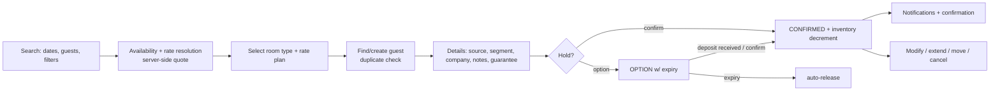
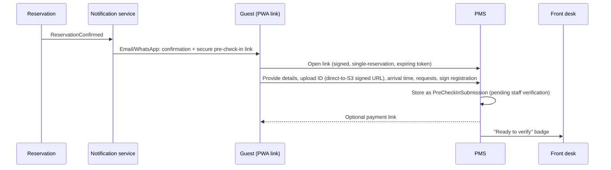
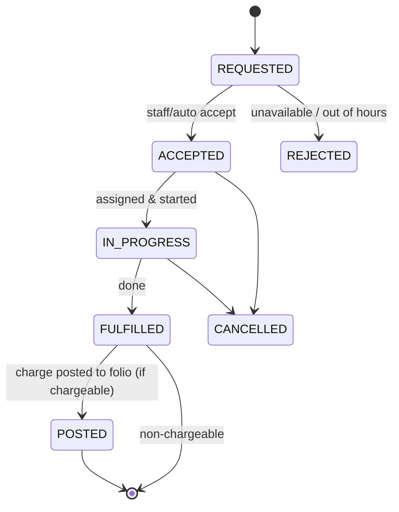
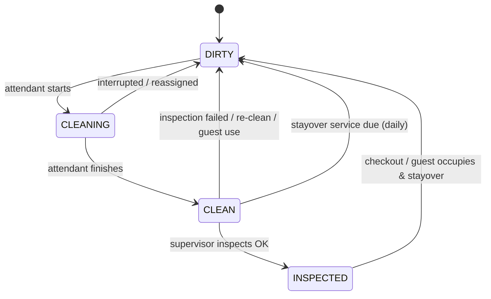
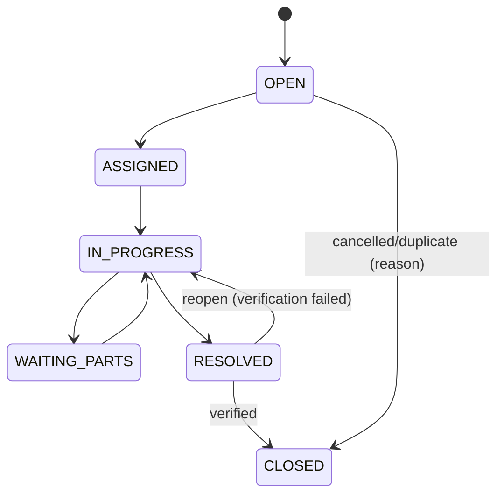

# 02 — Journeys & Operational Workflows
Covers **G–Q** (checklist items 9–17). Each journey lists steps, system rules, failure modes and leakage/overbooking controls. Tiering: **[M]** MVP, **[P2]**, **[P3]**.

---

## G. Property Onboarding Journey

**Goal:** a hotel administrator configures a property without technical help; a 10-room guesthouse in ≈30–45 min, a 100-room hotel in a few hours (with CSV import).

**Principles:** resumable wizard (draft state per step), every step validated, nothing goes "live" (sellable) until a **Go-Live Checklist** passes, sensible **Pakistan pack** defaults (currency PKR, timezone Asia/Karachi, check-in 14:00 / check-out 12:00, tax templates *as editable suggestions*), "Load sample setup" option, bulk import.

| Step | Content | Validation / rules |
|---|---|---|
| 1 Business | Name, brand, legal entity (create-on-the-fly), NTN/STRN/registration numbers, contact, timezone, currency, languages, check-in/out times | Timezone immutable after first reservation (change requires support); currency immutable after first posting |
| 2 Structure | Buildings/wings/floors | Optional; floor numbering templates ("G,1–8") |
| 3 Room types | Name, code, max adults/children/occupancy, base occupancy, bed setup, size, description, images, extra-person rules | Unique code per property |
| 4 Rooms | Number, floor, type, capacity override, beds, smoking, accessible, connecting, status; **bulk generator** ("101–120, floor 1, Deluxe") + CSV | Unique room number; every room has a type; connecting is symmetric |
| 5 Amenities | From tenant catalogue (configurable), assigned to type and/or room | Types inherit, rooms override |
| 6 Rate plans | Base rate per room type, plan templates (Standard, Corporate, Weekend, AP, NR, B&B, Room-only, Long-stay, Seasonal); restrictions | Every sellable type needs ≥1 active plan with a rate for the horizon |
| 7 Taxes & fees | Tax codes, rates, applicability, inclusive/exclusive, service charge, city tax, rounding | "Preview invoice" simulator shows a sample stay total |
| 8 Services | Catalogue items (breakfast, laundry, airport transfer, extra bed…), price, tax, department | Basic **[M]** |
| 9 Policies | Cancellation, no-show, child, extra bed, pets, smoking, early/late | Machine-readable (e.g., "free until 48h, then 1 night") so fees compute automatically |
| 10 Payment methods | Cash, bank accounts, cards (manual), corporate credit; gateway keys **[P2]** | Bank accounts belong to legal entity |
| 11 Users | Invite staff with roles per property; MFA enforced for managers | Role scope; invitation email/WhatsApp |
| 12 Channels | Hidden in MVP; visible when entitlement enabled **[P2]** | — |
| Go-live | Checklist: opening business date set, opening balances (in-house guests/reservations import), test reservation, printer/PDF test | Sets `property.business_date` and `status=LIVE` |

**Migration paths [M/P2]:** CSV import for rooms/guests/future reservations; "opening in-house" import for cut-over; assisted onboarding by Implementation Specialist (back-office impersonation with grant).

**Risks:** wrong tax config → revenue/legal errors ⇒ simulator + accountant sign-off checkbox recorded in audit; wrong timezone ⇒ wrong business date.

---

## H. Reservation Journey

**Rules**
1. **Quote → Book** pattern: search returns a signed, short-lived quote (per-night prices, taxes, restrictions evaluated). Booking re-validates everything server-side inside the inventory transaction; if the price changed, the client must re-confirm.
2. Booking transaction: validate permission → validate rate/restrictions → conditional inventory UPDATE → insert reservation/room/nights → insert state history → outbox event. Idempotency key required.
3. Room type reserved first; **assignment optional** until arrival (auto-assign suggestions at T-1 day [P2] or manual).
4. Modification produces a **new `reservation_version`** (immutable history) with diff, inventory delta applied atomically (release old nights, take new nights in one transaction; failure ⇒ no change).
5. Cancellation: policy engine computes penalty using **policy snapshot at booking time** (not today's policy); posts penalty to folio; releases inventory; frees deposits (liability) for refund/forfeit decision.
6. No-show: proposed automatically by Night Audit after cut-off; applies no-show policy; agent can override with reason.
7. Sources: `direct_phone`, `walk_in`, `website`, `ota:<provider>`, `corporate_portal`, `travel_agent`, `crs`; **source and channel are immutable** after creation (correctable only by manager with audit) to protect production reports.
8. Duplicate detection: same guest + overlapping dates + property ⇒ warn.
9. Guarantee/deposit: policy determines required deposit; option auto-expires if deposit not verified by deadline.

**Overbooking controls:** configurable thresholds; overbooking allowed only via `inventory_day.overbook_limit > 0` or explicit `reservation.override_availability` permission with reason; oversold nights appear in an **Oversold Worklist** with walk-plan tasks.

**Guest satisfaction controls:** confirmation via email + WhatsApp link with location pin; accurate cancellation terms echoed.

---

## I. Walk-in Journey [M] — target ≤60 seconds

1. `F2` (hotkey) opens Walk-in panel: arrival = business date, departure default +1, adults default 1–2.
2. Live availability by **physical room** (vacant + clean/inspected first; dirty rooms marked; rooms with `DEPARTING` today excluded unless flagged).
3. Select room → rate plan (default "Standard/Rack"), price shown with taxes; discount only within limits.
4. Guest: search by phone/CNIC first (scan/enter); create minimal profile if new (name, phone, nationality, ID number/type/photo).
5. Payment: collect deposit or first-night; cash requires open cashier session (blocked otherwise with one-click open).
6. One **"Check-in"** button: creates reservation (CONFIRMED) + stay + assigns room + posts deposit + prints/sends registration card + status Occupied. Performed as **one server transaction** (`WalkInCheckIn` command) — either all or nothing.
7. Foreign guests: passport + visa + Form-type capture as configured by jurisdiction pack.

**Failure modes:** room becomes unavailable between selection and submit ⇒ server returns conflict with alternatives; dirty room checked-in requires supervisor override; blacklisted guest ⇒ block/warn per policy.

---

## J. Corporate Reservation Journey

Variants (all **[M]** for staff-created; portal-created **[P2]**, with M = "booking request" submission):

**J1 Staff-created (M):** Agent selects company → contract rates auto-applied (rate plan `CORP-…` eligible for the company) → credit exposure check (limit − AR outstanding − open company-routed folios) → guest = traveler (linked employee) → folio routing: **Folio A** (room+tax → Company), **Folio B** (extras → Guest) per contract → booking confirmed with **billing reference / PO / cost centre** fields.

**J2 Portal booking (P2):** Travel coordinator picks property/dates within contract allowed properties → rate visible only to that company → if policy requires approval ⇒ `PENDING_APPROVAL` (no inventory hold beyond configured hold period / or soft-hold) → approver notified (email/WhatsApp) → approve ⇒ `CONFIRMED`; reject/expire ⇒ released.

**J3 Traveler request → Manager approves → confirmed (P2).**

**Controls:** credit limit breach ⇒ warn/block/override(approval); contract expiry blocks contract rates; cancellations follow the contract's own policy; monthly consolidated invoice generation; **WHT handling** on settlement (see V).

---

## K. Automated Pre-check-in Journey [P2]

- Token: random ≥128-bit, hashed at rest, bound to reservation, expires at checkout+N days, rate-limited, revocable; **no PII shown until a second factor** (last-4 phone digits or booking ref + surname).
- ID uploads: malware-scanned, EXIF stripped, encrypted (SSE-KMS + per-tenant data key), not visible to housekeeping/etc.
- Submission ≠ verified: staff verify against original at desk (or eKYC provider later).
- Consent captured (privacy notice version) before any sensitive data.
- **MVP fallback:** staff sends WhatsApp deep link with details/directions; registration completed at desk on tablet.

---

## L. Front Desk Check-in Journey [M]

1. Arrivals list (filter: unassigned, VIP, pre-checked-in, paid/unpaid), or global search (name, phone, confirmation #, CNIC last-4, room).
2. Open reservation → **Check-in panel** (single screen, not modal chain): guest details, ID verify (type/number/photo/scan), companions (each with ID where required), vehicle, arrival notes.
3. Room: assigned or assign now; only rooms with occupancy `VACANT`/`RESERVED-for-this` and housekeeping `CLEAN|INSPECTED` selectable (dirty → override permission + reason).
4. Financial: deposit/prepayment required by guarantee policy; collect payment; set folio routing.
5. Registration card generated (signature on tablet/pad or printed) → stored with hash.
6. Keys issued (record key count; DoorLock adapter call **[P3]**; failure never blocks check-in).
7. **Complete Check-in** ⇒ transaction: reservation_room→CHECKED_IN, `stay` created, room occupancy→OCCUPIED, folio opened, deposits applied, audit + events (`GuestCheckedIn`).
8. Early check-in: if room not ready → policy (fee/wait) → SMS/WhatsApp "room ready" later.

**Controls:** cannot check-in before business-date arrival without override; cannot check in cancelled/no-show without reinstate; identity mismatch flags logged.

---

## M. Guest Stay Journey

Pre-arrival → Arrival → Stay (services, housekeeping, folio visibility, requests, feedback) → Departure → Post-stay (invoice, feedback, marketing consent-gated).
- **Stay-time features:** room move (records `room_assignment_history`, HK tasks for both rooms, rate adjustments per policy), extend/shorten (availability + re-price), room change requests, additional guests, service requests, DND, late checkout, mid-stay bill review.
- **[P2]** Guest web/app: view folio (read-only), request services, chat (WhatsApp thread as MVP alternative), pay, express checkout.
- **Data:** stay-level events feed CRM preferences (learned preferences are *suggested*, staff-confirmed).

---

## N. Service Request Journey [P2; catalogue + manual posting in M]

- Service catalogue drives: category, price/tax, hours, lead time, fulfilment department, `charge_type` (`FIXED|PER_UNIT|PER_NIGHT|ON_REQUEST_QUOTE`), auto-post vs post-on-fulfilment.
- Request creates a generic **Task** (department queue) — HK, maintenance, F&B, transport, front desk share one Task engine.
- **Airport transfer** = specialised request with sub-state machine (`REQUESTED → CONFIRMED → DRIVER_ASSIGNED → EN_ROUTE → PICKED_UP → COMPLETED | CANCELLED`) and data (flight, terminal, pax, vehicle, driver, pickup time). Flight tracking API optional **[P3]**. Driver/vehicle can be internal or external vendor (vendor cost tracking P3).
- **Posting authorization:** to post to a room the system validates reservation status `CHECKED_IN` (or configured pre-arrival), folio open, guest identity/room match, and actor permission; failures never lose the request — the charge is parked as `PENDING_CHARGE` for front-desk resolution.

---

## O. Checkout Journey [M]

1. Departures list (business-date departures + overdue).
2. Open folio(s): review lines; **post pending** (minibar, late F&B, pending service charges); resolve **unsettled items** (disputes flagged, transfers).
3. Late checkout fee auto-suggested by policy/time.
4. Apply discounts/adjustments (limits/approval); reversals with reasons.
5. Settle: payment(s) across methods/folios (cash requires cashier session); **corporate portions** routed to company AR (no payment required); deposit refund/apply.
6. Issue invoice(s) per folio (gapless number, tax breakdown, PDF; WhatsApp/email link).
7. **Complete checkout** transaction: folio(s) CLOSED (balance must be 0 unless routed to AR/`house account` authorised), stay ends, reservation_room CHECKED_OUT, occupancy→`VACANT` (or `DEPARTING`→`VACANT`), housekeeping→`DIRTY`, **HK task created**, keys deactivated (adapter), events emitted.
8. Blocks: non-zero balance ⇒ cannot checkout without `checkout.with_balance` permission + reason + creates **receivable/`unsettled_balance` case** (leakage control).
9. **Express/mobile checkout [P2]:** guest reviews bill, disputes lines (creates `FolioDispute` for staff), pays, confirms; system auto-checkouts only if balance = 0 and no disputes/pending charges/minibar check pending (config); otherwise front-desk verification queue.

---

## P. Housekeeping Workflow [M]

**Two orthogonal statuses** (never merged): `occupancy_status` (VACANT, RESERVED*, OCCUPIED, DEPARTING*, OUT_OF_ORDER, OUT_OF_SERVICE) and `housekeeping_status` (CLEAN, DIRTY, CLEANING, INSPECTED, DO_NOT_DISTURB-as-flag). *`RESERVED` and `DEPARTING` are **derived** from reservations for the business date, not stored — only `VACANT/OCCUPIED/OOO/OOS` are stored (avoids stale data). DND is a **flag**, not an exclusive status (a room can be DND and dirty).

**Task generation (by Night Audit + events):** departures → checkout clean; stay-overs → daily service (skippable with DND/guest refusal); arrivals → priority ordering; OOO-return → deep clean; on-demand requests.
**Board:** filters by floor/building/status/priority; supervisor drag-assign to attendants; workload balancing (credit points per room type); **priority rules** (VIP, early arrival, same-day turn).
**Mobile:** assigned list, start/finish (timestamps), report issue (→ maintenance ticket, optional photo), minibar consumption (→ folio posting proposal, needs approval or auto by policy), lost & found log (photo, location), DND/refusal, offline queue (D-17).
**Inspection:** per-property setting (`require_inspection`); failed inspection returns task with notes.
**Metrics:** time per room, rooms per attendant/shift, rework rate.
**Controls:** rooms cannot be sold/assigned when `DIRTY` without override; occupancy `OUT_OF_ORDER` rooms excluded from housekeeping quotas.

---

## Q. Maintenance Workflow [M]

- Ticket: property, room/area, category, issue, priority (P1 safety → P4), photos, reporter, assignee, SLA due, cost (parts/labour, P2), resolution notes.
- **OOO / OOS blocks** are *separate objects* (`room_block`: room, type=`OUT_OF_ORDER|OUT_OF_SERVICE`, `date_range`, reason, ticket link, created_by) — creating/editing/removing a block runs the **inventory transaction** (decrement/increment `inventory_day.out_of_order`). Difference: **OOO** removes from sellable inventory (and statistics per property setting); **OOS** is short-term unavailable but still counted in inventory for statistics (industry convention; configurable).
- **Conflict resolution:** if an OOO block would create oversold nights (reservations already assigned to that room/type), the UI lists impacted reservations, offers reassign/upgrade, and requires manager approval + reason; the block is not silently applied and **never silently cancels reservations**.
- Room returns: when block ends or ticket resolved → room `DIRTY` for post-maintenance clean/inspection before selling.
- Recurring/preventive maintenance and asset registry **[P3]**.
