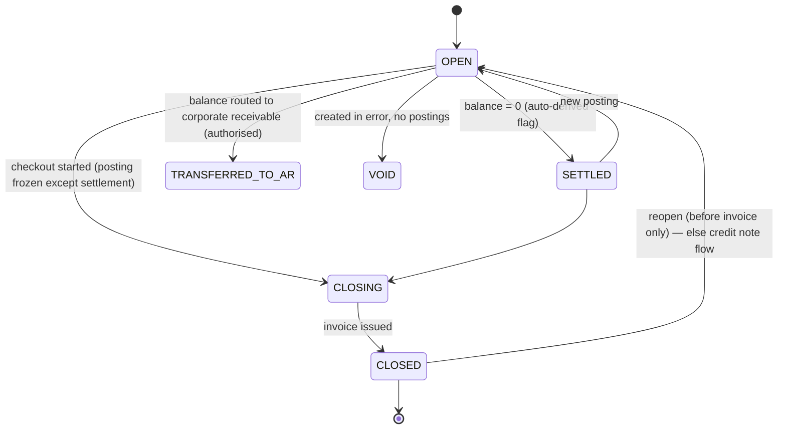
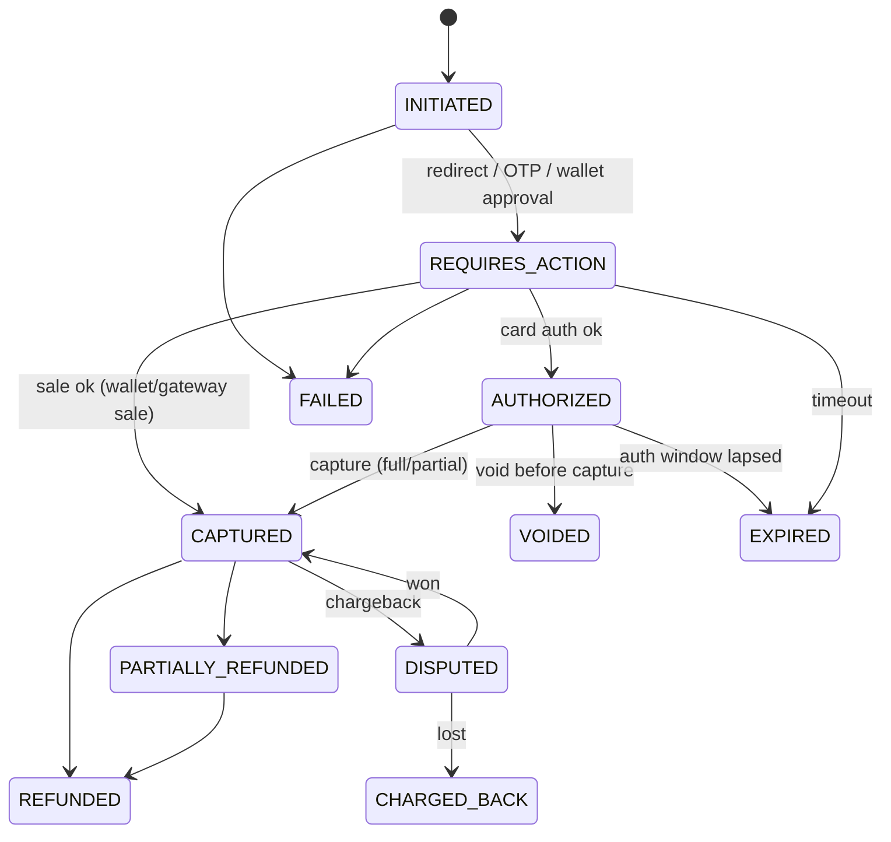
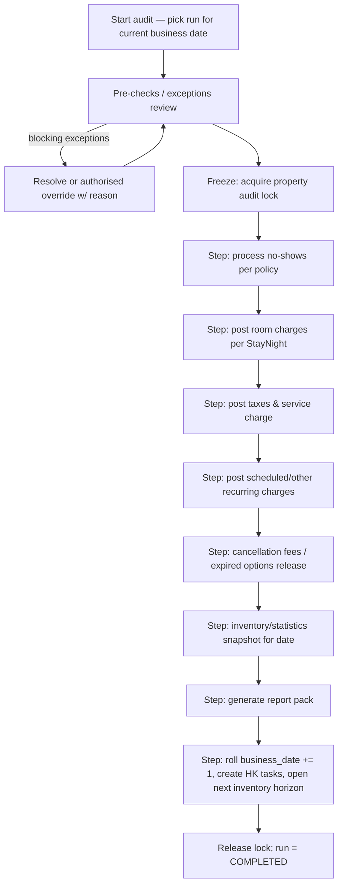
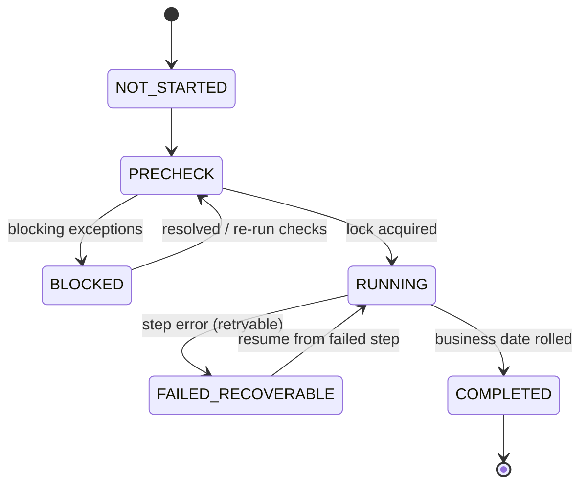
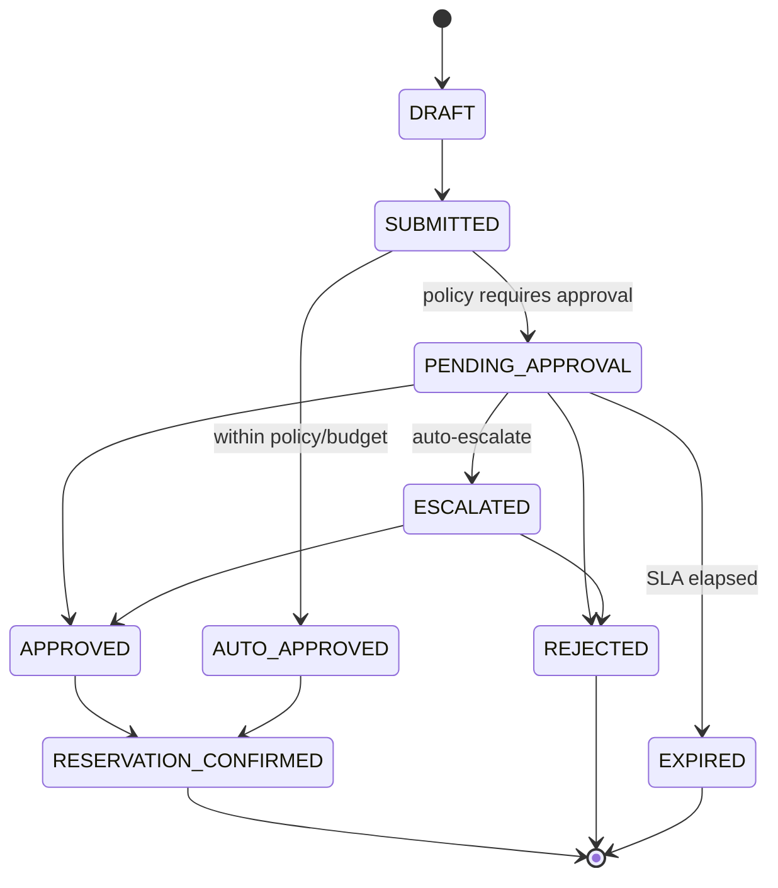
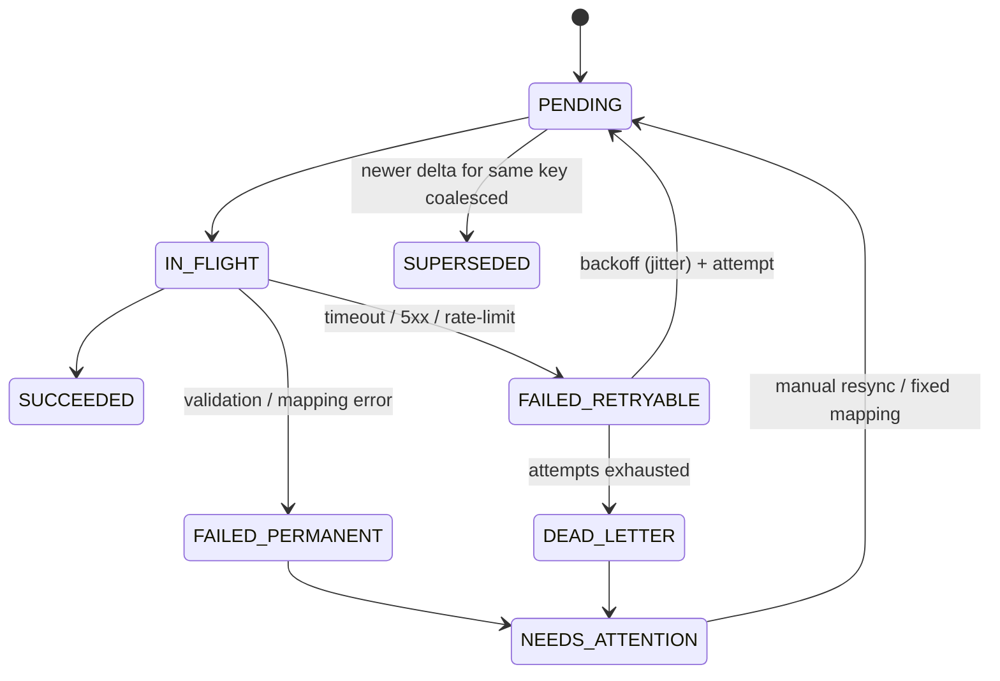

# 03 — Money & Mission-Critical Domains
Covers **R** Folio & Billing · **S** Payments · **T** Cashier · **U** Night Audit · **V** Corporate Accounts, plus the **state machines** (checklist items 18–23 and the state-machine section). SQL blocks are *illustrative design sketches*, not migrations.

---

## R. Folio & Billing Architecture

### R.1 Concepts
```
Reservation ─< ReservationRoom ─< StayNight (one row per night: rate snapshot, tax snapshot, status)
     │
     └─< Folio (type: GUEST | MASTER | COMPANY | HOUSE | GROUP_MASTER, bill_to_party, status)
              └─< FolioPosting  (IMMUTABLE ledger rows)
Folio ─< Invoice (immutable legal document, gapless number) ─< CreditNote
RoutingRule: (reservation | reservation_room | group) × (txn_code | txn_group) → target folio
```
- **A reservation can have many folios** (e.g., Folio A room+tax → Company; Folio B F&B/laundry → Guest; Group master folio + individual folios).
- **Posting** = the only way money changes. Types: `CHARGE`, `TAX`, `SERVICE_CHARGE`, `DISCOUNT`, `PAYMENT`, `DEPOSIT_RECEIVED`, `DEPOSIT_APPLIED`, `REFUND`, `ADJUSTMENT`, `REVERSAL`, `TRANSFER_OUT`, `TRANSFER_IN`, `WRITE_OFF`.
- **Balance is derived** (`SUM(amount)` by folio) and cached in `folio_balance` in the same transaction; nightly recompute must equal cached or alert.

### R.2 Illustrative table sketch
```sql
CREATE TABLE folio_posting (
  id                uuid PRIMARY KEY,
  tenant_id         uuid NOT NULL,
  property_id       uuid NOT NULL,
  legal_entity_id   uuid NOT NULL,
  folio_id          uuid NOT NULL,
  posting_type      text NOT NULL CHECK (posting_type IN (...)),
  txn_code_id       uuid NOT NULL,           -- maps to ledger account & report group
  amount_minor      bigint NOT NULL,         -- signed: charges +, payments −
  currency          char(3) NOT NULL,
  base_amount_minor bigint, fx_rate_id uuid, -- reserved for multi-currency
  quantity          numeric(12,3) DEFAULT 1, unit_price_minor bigint,
  business_date     date NOT NULL,           -- hotel business date (NOT system date)
  posted_at         timestamptz NOT NULL DEFAULT now(),
  source_type       text NOT NULL,           -- NIGHT_AUDIT | MANUAL | POS | SERVICE | PAYMENT | ...
  source_ref        text,                    -- external/order/stay_night id
  tax_rule_id       uuid, tax_rate_bp int,   -- snapshot
  parent_posting_id uuid,                    -- tax line → its charge
  reverses_posting_id uuid REFERENCES folio_posting(id),
  transfer_group_id uuid,
  cashier_session_id uuid,
  reason_code       text, note text,
  idempotency_key   text,
  created_by        uuid NOT NULL,
  UNIQUE (tenant_id, idempotency_key),
  UNIQUE (tenant_id, source_type, source_ref, txn_code_id)  -- e.g. one ROOM charge per stay_night
);
-- App role: INSERT, SELECT only. Trigger: RAISE on UPDATE/DELETE. RLS on tenant_id.
-- CHECK: reversal posting amount = −(original) unless partial with explicit flag.
```
- Room-charge uniqueness `(stay_night_id, txn_code)` is what makes **Night Audit idempotent** at DB level.
- **Closed business dates**: a trigger/check rejects postings with `business_date < property.business_date`.

### R.3 Operations
| Operation | Implementation | Controls |
|---|---|---|
| Post charge | Insert CHARGE + computed TAX postings atomically | Folio must be OPEN; txn code allowed for folio |
| Discount | DISCOUNT posting (negative) referencing charge | Limits by role; reason; approval above limit |
| Adjust/Correct | REVERSAL of original + new CHARGE (never edit) | Reason mandatory; before-close within same shift may be "void" (still stored as reversal) |
| Transfer charge | TRANSFER_OUT on A + TRANSFER_IN on B, one transaction, shared `transfer_group_id` | Same tenant/property; target folio open; permission |
| Transfer payment | Same pattern | Cash payments tied to session — transfer keeps original session attribution |
| Split folio | Create folio B; move chosen postings via transfer pair; or set **routing rules** so *future* postings route automatically | Keep audit link |
| Route charge | `RoutingRule` evaluated at posting time by (txn_code, room, date-range) | Rules snapshot on posting (`routing_rule_id`) |
| Deposit | `DEPOSIT_RECEIVED` to **deposit ledger** (liability), applied at check-in/checkout via `DEPOSIT_APPLIED` pair | Forfeit = posting to revenue with policy reference |
| Refund | Payment-provider refund or cash refund posting; requires prior payment linkage; partial allowed up to remaining | Refund limit permission; cash refund needs open session |
| Close folio | Requires balance 0 or authorised routing to AR/write-off; generates invoice | Invoice numbering below |
| Reopen | Only before invoice issued; after issue ⇒ credit note + new invoice | Manager permission + reason |

### R.4 Taxes & fees engine (jurisdiction-neutral)
- Entities: `tax_jurisdiction`, `tax_code` (e.g., `PROV_SALES_TAX`, `SERVICE_CHARGE`, `CITY_TAX`), `tax_rule` (effective-dated: rate basis points or fixed, applies-to txn groups, thresholds/bands, inclusive/exclusive, compounding order, min/max, exemption categories), `tax_exemption` (guest/company/diplomatic with certificate reference), `rounding_policy`.
- **Pakistan pack** = seed data + report templates + invoice layout only (`jurisdiction_pack='PK'`). Provincial regimes (Sindh/Punjab/KP/Balochistan/Islamabad) and any e-invoicing/POS-integration obligations **must be validated with a Pakistani tax advisor before pack release** (see AU). Core has zero PK constants.
- Tax rate & rule **snapshotted on every posting**; future rate changes never restate history.
- Compute order: charge → discounts → service charge → taxes (per rule order) → rounding.

### R.5 Invoicing
- `invoice_series` per **legal entity × fiscal year × document type**; number allocated in-transaction from `invoice_counter` row with `FOR UPDATE` (gapless). Documents immutable; reissue via credit note + new invoice.
- Invoice snapshot stores legal-entity details (NTN/STRN, address), customer (guest or company), lines, tax breakdown, folio reference, QR/fiscal fields via jurisdiction pack.
- Proforma/"interim bill" distinct from tax invoice.

### R.6 Folio lifecycle


### R.7 Leakage & discrepancy scenarios addressed
| Scenario | Control |
|---|---|
| Room charge missed for a night | Night Audit exceptions + nightly invariant: every occupied StayNight has a ROOM posting |
| Staff voids cash payment after taking cash | Voids are reversals in *same* session only; cash reversal requires supervisor; every reversal reported daily |
| Comp room without approval | `comp` is a rate plan with approval permission; report of comps by user |
| Charge posted to wrong room | Room posting validation (guest+room+reservation); transfer with reason; audit |
| Deposit taken but never applied | Deposit ledger aging report; audit closes only when reconciled |
| Checkout with balance | Permission + reason + receivable case |
| Backdated edits after close | Prohibited; adjustments on current date referencing original |
| Rounding differences between invoice and ledger | Rounding policy stored; invoice totals derived from postings |

---

## S. Payment Architecture

### S.1 Entities
`payment` (business record) → `payment_attempt` (provider interaction) → `payment_event` (raw webhook/provider events, immutable) → `refund` → `settlement_batch` / `settlement_line` (P2) → `folio_posting` (ledger link).
`payment_method` (tenant/property config: CASH, BANK_TRANSFER, CARD_MANUAL, GATEWAY:<provider>, WALLET:JAZZCASH/EASYPAISA, CORPORATE_CREDIT, OTA_VCC), `payment_provider_account` (encrypted credentials per property/legal entity), `payment_proof` (bank-transfer screenshot/reference).

### S.2 PaymentProvider port
```
interface PaymentProvider {
  createIntent(req): IntentResult          // amount, currency, reference, return URLs
  authorize / capture / void(paymentId)
  refund(paymentId, amount, reason)
  parseWebhook(rawBody, headers): ProviderEvent  // verifies signature
  fetchStatus(providerRef)                        // for reconciliation & lost webhooks
  fetchSettlements(dateRange)                     // P2
}
```
Adapters live in `integrations/payments/<provider>`; core never imports provider SDKs. Candidate Pakistani providers/wallets (JazzCash, Easypaisa, bank-backed gateways, aggregators, Raast-based flows) each require **merchant onboarding and current API documentation review before commitment** (see AI).

### S.3 Payment state machine

**Manual methods** use a reduced machine: cash `CAPTURED` immediately (session-bound); bank transfer `PENDING_VERIFICATION → CAPTURED | REJECTED`; POS-slip `CAPTURED` with RRN/last4 + approval code.

### S.4 Webhook & idempotency rules
1. Raw body stored in `payment_event` (immutable) *before* processing.
2. Signature verified per provider; IP allow-list where offered.
3. Deduplicate on `(provider, provider_event_id)` unique; secondary dedupe on `(provider_payment_ref, status)`.
4. Processing runs in one DB transaction: lock `payment` row → validate transition (invalid/out-of-order events are recorded but ignored/flagged) → update state → insert folio posting (idempotency key = payment id + transition) → outbox event.
5. Out-of-order/late events: reconcile by `fetchStatus`; scheduled **pending-payment sweeper** polls provider for stale INITIATED/REQUIRES_ACTION.
6. Never mark a folio paid based on client redirect/return URL alone — only on verified provider event or `fetchStatus`.
7. Amount and currency from provider must equal expected — mismatch ⇒ `FLAGGED` for manual review.

### S.5 Deposits, pre-auth, refunds
- Deposit policy (per rate plan/property): % or nights, due date, refundability window.
- Pre-authorisation tracking: auth id, amount, expiry; reminders to capture/release before expiry [P2].
- Refund destinations: original method preferred; cash refund needs session; refunds to bank/wallet requires recorded beneficiary details verified by second user (fraud control).

### S.6 Reconciliation [P2]
Daily import of gateway settlement reports (API/CSV/SFTP) → matching engine: `payment` ↔ `settlement_line` by provider ref/amount/date → statuses `MATCHED`, `MISSING_IN_PMS`, `MISSING_IN_SETTLEMENT`, `AMOUNT_MISMATCH`, `FEE_VARIANCE` → exceptions worklist for finance.

---

## T. Cashier & Shift Architecture

### T.1 Entities
`cash_register` (drawer/till, property, department), `cashier_session`, `cashier_session_line` view (derived from postings), `cash_drop` (to safe), `safe_count`, `variance_review`.

### T.2 Session lifecycle

```mermaid
stateDiagram-v2
  [*] --> OPEN: opening float counted (by cashier; verified by supervisor optional)
  OPEN --> CLOSING: cashier starts close (blind count entry)
  CLOSING --> CLOSED: count submitted; expected vs counted computed; variance stored
  CLOSED --> REVIEWED: manager reviews; variance approved/queried (reason)
  CLOSED --> RECOUNT_REQUESTED
  RECOUNT_REQUESTED --> CLOSING
```

- **Rules:** one open session per user per register; any **cash** posting requires `cashier_session_id` of an OPEN session (DB check via posting rule); **blind close** (expected amount hidden until count submitted); cash drops recorded with two-person confirmation above threshold; handover shift-to-shift possible; non-cash tenders (card slips, transfers) also summarised per session for reconciliation with terminal batch/bank.
- **Expected cash** = opening float + cash receipts − cash refunds − drops ± adjustments. **Variance** = counted − expected; auto-flag over thresholds; repeated variance per user analytics.
- Night Audit **blocks** while any session is OPEN (or force-close by manager with reason).
- Reports: session report, shift summary by tender, variance by cashier/date, drops.

---

## U. Night Audit Architecture

### U.1 Principle
**System date ≠ business date.** `property.business_date` is a stored value advanced only by a successful audit. Everything financial uses it. Users can keep working during the audit window unless the run reaches the *posting freeze* step (short, atomic).

### U.2 Workflow

**Pre-check exceptions** (each classified *blocking / warning*): arrivals not checked in (mark no-show / extend hold), departures not checked out (extend/checkout), open cashier sessions (blocking), unposted room charges, folios with unresolved balances, unverified bank-transfer payments, unsettled provider payments, OOO rooms with expired ranges, rooms `OCCUPIED` without stay, oversold nights, guests without ID.

### U.3 Data model
`night_audit_run(id, tenant, property, business_date, status, started_by, started_at, completed_at, mode=MANUAL|AUTO, summary_json)` with **UNIQUE (property_id, business_date) WHERE status IN ('RUNNING','POSTING','COMPLETED')**; `night_audit_step(run_id, step_key, seq, status, attempts, started_at, finished_at, checkpoint_json, error)`, `night_audit_exception(run_id, kind, ref, severity, resolution, resolved_by, reason)`, `daily_property_stats`, `daily_revenue_line` (snapshots).

### U.4 State machine

No "rollback" state: correcting mistakes is done by adjustments on the new date (accounting principle). A **"reopen previous day"** capability, if ever built, would be a Finance-only, heavily audited feature (not MVP).

### U.5 Idempotency & recovery
- Each step is safe to re-run: guarded by DB uniqueness (`(stay_night_id, txn_code)` for room charges; `(run_id, step_key)` for steps; `(reservation_room_id, business_date, 'NOSHOW')`).
- Steps commit in **batches** with checkpoints (e.g., 200 stay nights) → resumable after crash; worker crash mid-batch ⇒ retry picks up.
- The **roll** step is one transaction: `UPDATE property SET business_date = business_date + 1 WHERE id=? AND business_date = :expected` (compare-and-set) — duplicate or concurrent execution cannot double-roll.
- Monitoring: run duration, exceptions count, failures alert to property manager + platform on-call.
- **Auto-audit [P2]:** for small properties, schedule at configured time with auto-resolved non-blocking exceptions and manager summary; blocking exceptions stop and notify.
- Multi-property groups: each property has its own business date; group reports use each property's date (label clearly).

### U.6 Reports produced
Daily revenue (by txn group, room type, source, segment, rate plan), Occupancy, ADR, RevPAR, Arrivals, Departures, In-house, No-shows, Cancellations, Room/F&B/Other revenue, Taxes, Payments by tender, Cashier variance, Outstanding folios (guest ledger), Corporate receivables, Deposit ledger, Comp/discount report, Audit exceptions log. **Immutable snapshots** with `generated_at`, `run_id`.

**Definitions (configurable, documented):** Occupancy = rooms sold ÷ rooms available (property setting: whether OOO rooms are excluded from "available"); ADR = room revenue ÷ rooms sold; RevPAR = room revenue ÷ rooms available; comp/house-use excluded from ADR by default.

---

## V. Corporate Accounts Architecture

### V.1 Separation of ledgers
**Guest ledger** (folios: what in-house guests owe) is *distinct* from **city/accounts-receivable ledger** (what companies/agents/OTAs owe on issued invoices). Moving a balance from folio to AR is an explicit, audited, permissioned transaction.

### V.2 Entities
`company` (tenant-scoped; type: CORPORATE | TRAVEL_AGENT | OTA | GOVERNMENT | OTHER), `company_branch`, `company_contact`, `corporate_contract` (scope: properties, validity, payment terms `NET_n`, credit limit, billing cycle, tax info, cancellation terms, documents), `corporate_rate` (rate plan link + rules: fixed, % off BAR, room-type-specific, seasonal blackouts, LRA/non-LRA), `company_traveler`, `cost_center`, `department`, `approval_policy`, `approval_request`, `ar_account` (company × legal entity × currency), `ar_invoice` (consolidates folios/periods), `ar_invoice_line` → folio/posting refs, `ar_payment`, `ar_allocation`, `ar_credit_note`, `ar_statement`, `credit_limit_change` (audited).

### V.3 Credit
- `available_credit = credit_limit − outstanding_AR − unbilled_exposure` where unbilled exposure = open company-routed folio balances + future confirmed company-routed reservations (estimated, configurable inclusion).
- Booking check policy: `WARN | BLOCK | REQUIRE_APPROVAL`; credit hold flag overrides. Credit limit changes need Finance approval + audit.
- **Aging** buckets 0–15/16–30/31–45/46–60/60+ (configurable), overdue reminders, statement generation, dunning [P2].
- **Withholding tax (WHT):** payments may arrive net of tax deducted at source; allocation supports `payment + withholding_tax_amount (with certificate ref)` closing the invoice while recording a tax-credit receivable/asset entry. *Confirm applicable regime with tax advisor.*
- Consolidated invoicing: per stay, weekly, or monthly cycles; PO/cost-centre/employee reference lines.

### V.4 Corporate Approval state machine

Approver ≠ requester; multi-level thresholds (amount, nights, city); delegation during absence.

### V.5 Corporate portal (tenant-branded)
Separate identity realm (`corporate`), company-scoped RLS-style guard (`company_id` from token); sees only reservations, invoices, statements and rates for its own company at properties within contract; never sees other companies or unrelated guests. MVP: view reservations/invoices/statements + submit booking request; P2: direct booking, approvals, cost centres, spend analytics, downloads.

---

# Reservation State Machine (authoritative) — plus other machines

## Reservation (header) and ReservationRoom

```mermaid
stateDiagram-v2
  [*] --> OPTION: hold w/ expiry
  [*] --> PENDING_APPROVAL: corporate approval
  [*] --> WAITLISTED
  [*] --> CONFIRMED
  OPTION --> CONFIRMED: deposit verified / agent confirms
  OPTION --> CANCELLED: expired or released
  PENDING_APPROVAL --> CONFIRMED
  PENDING_APPROVAL --> CANCELLED
  WAITLISTED --> CONFIRMED: inventory freed
  WAITLISTED --> CANCELLED
  CONFIRMED --> CHECKED_IN
  CONFIRMED --> CANCELLED
  CONFIRMED --> NO_SHOW
  NO_SHOW --> CONFIRMED: reinstate (perm.)
  CANCELLED --> CONFIRMED: reinstate if inventory (perm.)
  CHECKED_IN --> CHECKED_OUT
  CHECKED_IN --> CONFIRMED: undo check-in (same day, perm.+reason)
  CHECKED_OUT --> CHECKED_IN: reopen stay (perm.+reason; before folio close)
```

Guards: check-in only on/after arrival business date (override with reason); cancel only before check-in (after check-in ⇒ "early departure" = shorten stay); no-show only after cut-off on arrival date; `CHECKED_OUT` requires folio settled or authorised routing; every transition writes `reservation_state_history(from,to,actor,reason,at,request_id)` — insert-only. Header status = derived from rooms (all out ⇒ CHECKED_OUT, some in ⇒ CHECKED_IN, etc.); each ReservationRoom has its own status.

## Room occupancy (stored) vs derived
Stored: `VACANT ⇄ OCCUPIED`, `OUT_OF_ORDER`, `OUT_OF_SERVICE` (blocks). Derived per business date: `RESERVED` (assigned arrival today), `DEPARTING` (occupied with departure today). Transitions: check-in VACANT→OCCUPIED; checkout OCCUPIED→VACANT (+HK DIRTY); block start VACANT→OOO/OOS (if occupied ⇒ block scheduled from departure; or forced with room-move workflow); block end →VACANT (+DIRTY).

## Housekeeping — see P (02). Service Request — see N. Maintenance — see Q.

## Channel Sync (job level)

Inbound external reservation: `RECEIVED → NORMALIZED → MAPPED → APPLIED | QUARANTINED(unmapped/invalid) | DUPLICATE_IGNORED`.
