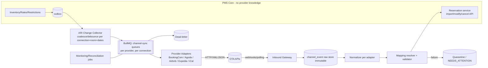

# 04 — Inventory Engine, Rates, CRS, Channels, Booking Engine, Apps, Back Office, Reporting
Covers **W–AC** plus the availability and rate engine designs they depend on (checklist items 24 partial, 32–35).

---

## 0. Core engines

### 0.1 Availability engine (detail behind D-05)

**Definitions (per property × room type × night):**
| Term | Definition |
|---|---|
| Physical | Active rooms of the type (`room.status = ACTIVE`) |
| Out-of-order (OOO) | Rooms under OOO blocks that night |
| Out-of-service (OOS) | Short-term blocks (configurable: counts against sellable or not) |
| Sellable | Physical − OOO − house-use/out-of-inventory |
| Blocked | Group/allotment blocks not yet picked up (reduces *general* availability) |
| Reserved | Confirmed / in-house room-nights |
| Held | Unexpired OPTION / booking-engine checkout holds (short TTL) |
| Overbook limit | Extra sellable units allowed (per property / room type / date override) |
| **Available** | `Sellable − Blocked − Reserved − Held + OverbookLimit` (≥ 0 enforced) |

**Write path (all in one PG transaction):**
```sql
-- for each night in date order (deadlock-safe):
UPDATE inventory_day
   SET reserved = reserved + :n, version = version + 1
 WHERE tenant_id=:t AND property_id=:p AND room_type_id=:rt AND business_date=:d
   AND (physical - out_of_order - blocked - reserved - held + overbook_limit) >= :n
RETURNING ...;      -- 0 rows ⇒ sold out for that night ⇒ abort txn, return alternatives
```
- Plus `CHECK (reserved >= 0 AND held >= 0)`; oversold *by administrative change* (e.g., OOO creation) is allowed only through the explicit resolution workflow and marks `oversold_flag` on impacted rows.
- Physical assignment: `room_assignment(room_id, stay_range daterange, status)` with `EXCLUDE USING gist (room_id WITH =, stay_range WITH &&) WHERE (status IN ('ASSIGNED','IN_HOUSE'))`. Room moves = end old assignment range + start new in one transaction with `room_assignment_history`.
- Horizon: `inventory_day` rows pre-generated N days ahead (e.g., 730) by a job; created on property go-live; extended nightly.
- Adjustments to physical room count (adding/removing rooms, changing type) regenerate future rows in a controlled transaction with impact check.
- **Read path:** `GET availability` returns per-night availability and restrictions, computed from `inventory_day` + rate restrictions; cache ≤ 30 s for public search only; **booking always re-checks in DB**.
- **Conflict handling:** concurrent bookings for the last unit ⇒ exactly one succeeds (atomic UPDATE), the other gets `409 AVAILABILITY_CHANGED` with fresh alternatives.
- **Invariant checker (nightly + on-demand):** recompute `reserved/held/out_of_order/blocked` from source tables and compare; drift ⇒ alert + auto-repair job with audit (never silent).
- **Modification** = delta (old nights released and new nights taken in the same transaction; reduce-then-increase with row locks sorted).
- **Group blocks:** `room_block_allotment` per type/night reduces general availability; pickup moves from `blocked` to `reserved` atomically; release at cut-off by job.

### 0.2 Rate engine

**Resolution pipeline (server-side only; the UI, apps, AI, and channel adapters all call it):**
```
Inputs: property, room type, stay dates, occupancy, rate plan candidates, channel/source, company, guest attrs (nationality/residency), promo, booking timestamp
1. ELIGIBILITY: rate plan active + sellable for channel/source; company contract valid; guest-attribute eligibility; booking window; LOS
2. RESTRICTIONS per night: MinLOS/MaxLOS (by arrival), CTA, CTD, stop-sell, advance-purchase, closed
3. BASE PRICE per night, precedence (highest wins):
     negotiated/contract override > date-specific override (rate calendar) > seasonal rule > day-of-week rule > plan base
   Derived plans: price(parent) then rule (±%, ±fixed, rounding)
4. OCCUPANCY adjustment: base occupancy, extra adult/child bands, per-person or flat
5. PACKAGE/ADD-ONS: inclusions (breakfast) as components (separate revenue codes even when bundled — "package allocation")
6. DISCOUNTS: promo/manual (limits, approval)
7. TAXES/FEES: tax engine (inclusive/exclusive)
8. OUTPUT: RateQuote { per-night breakdown, totals, restrictions evaluated, cancellation policy snapshot, validity TTL, hash/signature }
```
- **Rate snapshot**: on booking, the per-night amounts, plan version, tax snapshot and policy snapshot are stored on `stay_night` — later rate edits never change existing bookings unless explicitly repriced (with audit).
- **Versioning**: `rate_plan_version`, `rate_value` rows are effective-dated; rate calendar edits are audited (`before/after` per date-range).
- **Bulk edits** via range operations with preview & diff; guard rails (e.g., >30% change warns; below floor rate blocks).
- **Floor/ceiling** per room type/plan; AI/automation may *propose* changes but only through the same permissioned command path.
- **Revenue management (P3):** recommendations table `rate_recommendation(status: PROPOSED|APPROVED|REJECTED|APPLIED, rationale, model_version)`; application uses the human-approved path or an explicit automation rule with guardrails.

---

## W. Central Reservation System (CRS) Architecture [P2; data model supports from MVP]

**Capabilities:** cross-property search (city/region/brand, dates, occupancy, filters) → ranked results (property, room type, best rate, availability, restrictions) → create reservation at any authorised property → tenant-wide guest profile → consolidated reporting.

**Design**
- `crs.search(query)` fan-out: filter properties by user's `property scopes` + geo/brand → for each property call AvailabilityService + RateEngine in parallel (bounded concurrency, per-property timeout 800ms, partial-results with "unavailable" markers). Cache results ≤ 30 s keyed by `(tenant, propertySet, dates, occupancy, plan-set)` for *display only*.
- **Booking always executes in the target property's inventory transaction** (no cross-property transaction). Multi-property itineraries = `booking` (customer order) with several property reservations; partial failure ⇒ compensating cancel of created ones (saga with idempotency keys) and clear agent messaging.
- Authorisation: CRA role assigned at tenant or property-set scope; each result and booking authorised per property.
- Central guest & company data shared *within tenant only*.
- Property-specific policies/taxes/legal entity respected; invoice issued by the property's legal entity.
- Commission/transfer pricing between properties/entities — out of scope until required (flag).

---

## X. Channel Manager Architecture [abstraction M; providers P2]

### X.1 Component view


### X.2 Ports & adapters
```
interface ChannelProvider {
  key: string; capabilities: {ari: bool, reservations: 'push'|'pull', modifications: bool, ...}
  authenticate/connect(connection)
  pushAvailability(connection, deltas[])   pushRates(...)   pushRestrictions(...)
  pullReservations(connection, since)                       // or webhook handler
  acknowledgeReservation(connection, externalRef)
  parseWebhook(headers, rawBody) -> ExternalEvent[]
  fetchRoomsAndRates(connection) -> ExternalCatalog          // for mapping UI
  validateMapping(mapping) -> Issue[]
  healthCheck(connection)
}
```
The core exposes only **domain-neutral** `ExternalReservation` canonical DTO (guest, dates, occupancy, room type ref, rate plan ref, prices, taxes, payment info, commission, status, external ids, raw payload ref). **No provider fields in the reservation domain** — provider-specific data lives in `external_reservation.raw` + adapter tables.

### X.3 Data (per requirement)
`channel` (catalogue) · `channel_connection` (tenant, property, provider, encrypted credentials, external property id, status, last_sync) · `channel_room_mapping` (PMS room type ↔ external room id, occupancy config) · `channel_rate_mapping` (PMS rate plan ↔ external rate plan id, derived rule) · `external_reservation` (provider, external reservation id, external property id, external room type id, external rate plan id, version/modified timestamp, status, `reservation_id` link, last_sync, sync_status, errors, raw JSONB) · `channel_event` (immutable inbound) · `channel_sync_job` (outbound, per delta batch; status per machine in 03) · `channel_sync_log` · `channel_dead_letter` · `channel_resync_request` (manual) · `channel_mapping_audit`.

### X.4 Inbound handling
1. Persist raw event → return 2xx quickly (webhooks) / record poll cursor.
2. **De-duplicate** on `(provider, external_event_id)` and on `(provider, external_reservation_id, external_version)`; older versions ignored, newer applied (handles delayed/out-of-order events).
3. Normalize → resolve mapping (external room/rate → PMS ids). **Unmapped ⇒ quarantine, alert, do NOT drop, and still hold inventory conservatively if dates+ any-room can be inferred is impossible → create "UNMAPPED" placeholder reservation on a configurable default room type** (policy per property) so the hotel doesn't oversell while fixing mapping.
4. Apply via `ReservationService.importExternal` (idempotent by external id; new/modify/cancel). **Inbound reservations are accepted even if the PMS is sold out** (the OTA has sold it): mark oversold, raise walk-alert; never reject silently.
5. Acknowledge to provider only after commit.
6. Every step audited; payloads retained per policy.

### X.5 Outbound ARI
- `InventoryChanged`, `RateChanged`, `RestrictionChanged` outbox events → **coalescer** merges per `(connection, mapped room/rate, date range)` within a short window (e.g., 5–15 s) → builds delta payloads (only changed dates) → rate-limit governed sender (token bucket per connection & provider) → records `channel_sync_job`.
- **Full sync** scheduled (e.g., nightly + on-demand) to heal drift; **verification** (pull back and compare where supported).
- **Ordering:** version stamps per key ensure an old payload cannot overwrite a newer one (`SUPERSEDED`).
- **Resilience:** exponential backoff + jitter, circuit breaker per connection, provider-downtime queue depth alerts, DLQ, manual resync UI (range/room/rate), partial-sync tracking (some dates OK, others failed).
- **Safety valve:** if availability push has been failing > X minutes, notify hotel and offer "close sales on channel" fallback where API supports; hotel operations are **never** blocked by channel state.

### X.6 Mapping validation (high-risk; treated as a safety-critical feature)
- **Cannot activate a channel connection** until: every mapped PMS room type has ≥1 external room; each external room maps to exactly one PMS type (n→1 allowed only with explicit "shared inventory" warning); occupancy/capacity compatible (external max occupancy ≤ PMS max, extra-bed rules); currency match; meal-plan compatibility for rate mapping; derived-rate rules valid; no unmapped *active* external plans (warn); duplicate-mapping detection.
- **Dry-run diff** preview: what would be pushed for the next 30 days.
- **Change control:** mapping edits require `channel.map` permission, second-person approval on live connections (configurable), audit before/after, automatic full-resync + reconciliation after change, and a 24-hour "mapping changed" watch alert on unexpected inventory movement.
- **Monitoring:** anomaly alerts (inventory pushed lower/higher than PMS-calculated, sudden zero availability, reservations for unmapped types, oversold counts by channel).

### X.7 Reconciliation (P2 basic; P3 financial)
Scheduled compare of `external_reservation` vs PMS reservations (existence, dates, room type, price, status); missing/extra list; resolution actions logged. Financial OTA reconciliation (commission, VCC, settlement) is a P3 module (F.12).

### X.8 Sequencing recommendation
| Step | What | Why |
|---|---|---|
| MVP | Channel/source/segment fields, `ChannelProvider` interface, mapping tables, manual OTA-source reservations, inventory events emitting | Foundation without provider risk |
| Parallel non-engineering (start in MVP) | Apply for partner/connectivity programs; obtain sandbox credentials; decide direct vs aggregator | Certification lead times are long and outside our control |
| P2.0 | iCal import/export bridge (clearly flagged "delayed, higher double-booking risk") | Cheap value for guesthouses/Airbnb-style |
| P2.1 | First direct adapter — most likely **Booking.com** (dominant OTA in Pakistan; verify current market share and API access) | Highest demand |
| P2.2 | Agoda, then Expedia/Airbnb (invite/approval dependent) | |
| Alternative | Aggregator/channel-manager API partnership to cover many OTAs faster | Trade-off: margin and dependency vs speed |

### X.9 Provider facts that must be verified — **not assumed**
For each OTA we must obtain and read *current* partner documentation and access terms before design freeze: partner-program eligibility & certification steps; API style (XML/JSON/OpenAPI), authentication; supported ARI operations; reservation delivery model (push/pull/webhook) and acknowledgement rules; modification/cancellation semantics; rate-plan/derived-rate/meal-plan models; occupancy model; child-age handling; rate limits and payload limits; sandbox availability; payment/VCC model; commission data; content/photo APIs; SLA/deprecation policy; data-residency and PII terms. *This document deliberately makes no claims beyond the abstraction.*

---

## Y. Direct Booking Engine Architecture [P2]

- **App:** `guest-web` (Next.js). Hotel gets `book.<tenantdomain>` (CNAME + ACM cert via CloudFront custom domains) or `hotelwebsite.com/book` reverse proxy, plus **embeddable widget** (web component loaded via script tag → iframe/shadow-DOM, `postMessage` for resize/analytics).
- **Tenant resolution:** by domain → `booking_engine_config` (branding: logo/colours/fonts, languages, currencies, policies, promo, upsells, GA/Meta pixel IDs). Publishable key for public API; no private secrets in browser.
- **Flow:** dates/guests → **availability + quotes** (public read endpoints, cached ≤30 s, rate-limited, bot protection/CAPTCHA) → select room/rate/package/add-ons → guest details → **hold** (`held` counter with TTL 10–15 min, auto-release by job) → payment (hosted fields / redirect) → confirm → `ReservationConfirmed` → email/WhatsApp.
- **Consistency:** the quote token is signed with TTL; final booking runs the same transactional availability check; idempotency key per checkout attempt; payment webhook duplicates safe (S.4).
- **Payment modes** per property: pay-now, deposit %, pay-at-hotel (card/wallet guarantee or none), bank-transfer with deadline (creates OPTION with expiry).
- **Security/abuse:** rate-limit per IP+tenant, availability-scraping detection, hold-exhaustion protection (max concurrent holds per IP/session), PII minimisation, CSP/SRI on widget, fraud rules (velocity, mismatch country).
- **SEO/perf:** SSR of room content/images/JSON-LD schema; image CDN; target LCP < 2.5 s on 4G Pakistani mobile.
- **Analytics & attribution:** UTM capture → source/segment.
- **Multi-property:** property selector for groups (CRS-backed).
- **Rate parity:** direct rates ≥ configurable "best rate guarantee" rules; promo codes & member rates.

---

## Z. Guest Application Architecture [PWA P2; native P2-late/P3 — D-12]

- **Identity:** platform-level guest identity (phone OTP primary in Pakistan; email optional; WhatsApp OTP where available). Profile data remains **tenant-scoped**; the app shows the guest's own reservations from each participating tenant they've linked with consent; **no cross-tenant data mixing**, no tenant can see another tenant's guest data.
- **Feature ladder:** (1) reservation view + pre-check-in + directions; (2) room number/ready notice + digital key where supported; (3) folio view + pay + invoice + express checkout; (4) service requests, chat (WhatsApp channel first), F&B ordering, housekeeping/laundry/airport pickup/late checkout, feedback.
- **Tech:** Phase 2 = Next.js PWA (installable, push via web push where supported); native Expo app later when repeat-guest/loyalty value justifies store presence; white-label per tenant is a separate commercial decision (store ownership, review cycles).
- **Security:** short-lived tokens, device binding for digital keys, jailbreak/root detection for key features, remote sign-out, PII minimal on device, screenshots blocked on ID upload.
- **Offline:** cached reservation & instructions (read-only).

## AA. Staff Mobile Architecture [M for HK/Maintenance]

- **Expo React Native** `mobile-staff` (iOS/Android), roles determine visible modules (HK attendant, HK supervisor, maintenance, later: front-desk tablet, F&B, transport/driver).
- **Auth:** email/phone + PIN/biometric (device-bound refresh token, MFA for supervisors), remote revoke, auto-lock.
- **Offline-tolerant core:** local SQLite (expo-sqlite) for assigned tasks; **command queue** of idempotent operations (`clientOpId`) — start/finish room, report issue, add photo (deferred upload to S3 signed URL), lost & found. Server validates each command against current state (e.g., room already cleaned by someone else ⇒ conflict resolved with server truth + toast). No inventory or financial commands queued offline (D-17).
- **Push:** task assignment, priority changes (FCM/APNs via Expo push/own provider), fallback SMS/WhatsApp to supervisors.
- **UX:** big touch targets, icon-first, low-literacy friendly, Urdu labels (P2), dark mode, low-end Android (2 GB RAM) performance budget, small bundle size, image compression before upload.
- **Device policy:** minimal PII on device (no ID images), encrypted storage, MDM optional (P3).

---

## AB. Admin / SaaS Back Office Architecture [minimal M]

- **App:** `admin` (Next.js), separate origin and identity realm, mandatory MFA (WebAuthn preferred), IP allow-list optional, short sessions, dedicated API namespace `/platform/*` with its own RBAC and audit stream.
- **Modules:** tenant lifecycle (create/suspend/archive/export), property & entitlement overview, plan/price/add-on configuration (versioned), subscription & invoice management (manual→automated), usage metering dashboards, feature flags (per tenant/plan/percentage), provider catalogue (notification/payment/channel providers), support tooling, implementation checklists, announcements/maintenance banners, health & queue dashboards (embed CloudWatch/Grafana), data-retention/DSAR tooling, platform audit trail.
- **Support access ("impersonation") protocol:** tenant admin grants time-boxed, scoped access (or emergency break-glass with post-hoc notification); read-only by default; PII masked; every action stamped `actor=platform_user, on_behalf_of=tenant`; visible banner to the tenant; automatic expiry.
- **Separation:** platform staff cannot query tenant business tables directly in prod; break-glass DB access is logged, approved, time-limited.

---

## AC. Reporting & Analytics Architecture

| Layer | MVP | Later |
|---|---|---|
| Operational live (arrivals, in-house, availability, housekeeping, dashboards) | Indexed OLTP queries with small result windows; short cache | Read replica; SSE push |
| Historical financial/statistics | **Immutable snapshots** from Night Audit (`daily_property_stats`, `daily_revenue_line`, `daily_payment_summary`, `daily_ar_snapshot`) | Same, plus dimensions |
| Ad-hoc exports | Async report jobs (BullMQ) → CSV/XLSX/PDF in S3 → signed URL, notify | Scheduled email delivery |
| Cross-property (group) | Aggregation over snapshots (fast, cheap) | Warehouse |
| Analytics/BI/AI | — | Replicate (CDC or nightly) to columnar store; governed semantic layer; tenant-scoped credentials |

- **Report catalogue and definitions** are versioned; metrics (ADR/RevPAR/occupancy) have a single canonical SQL/semantic definition in code with tests.
- **Time semantics:** reports by **business date** (property tz); group reports display each property's date basis.
- **Access control:** report permission + property scope; PII columns masked unless permitted; exports logged.
- **Performance:** pagination/streaming for large exports; never load full history to browser; explain-plan gating in CI for report queries; partitioned snapshot tables.
- **AI-readiness:** the semantic layer (metric definitions, dimensions, allowed joins) is what NL-reporting would query — never raw tables; per-tenant credentials/RLS; result logging; refusal on cross-tenant intent.
