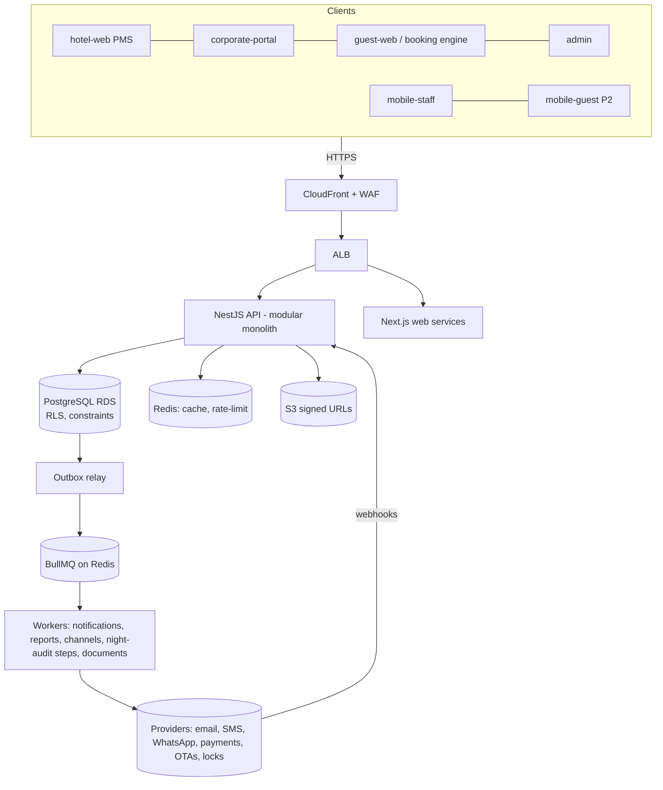
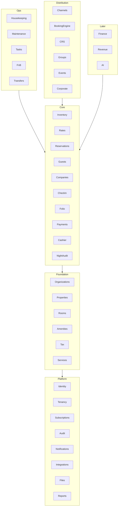
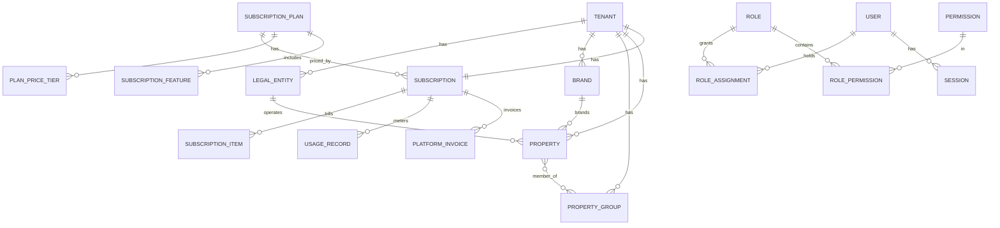
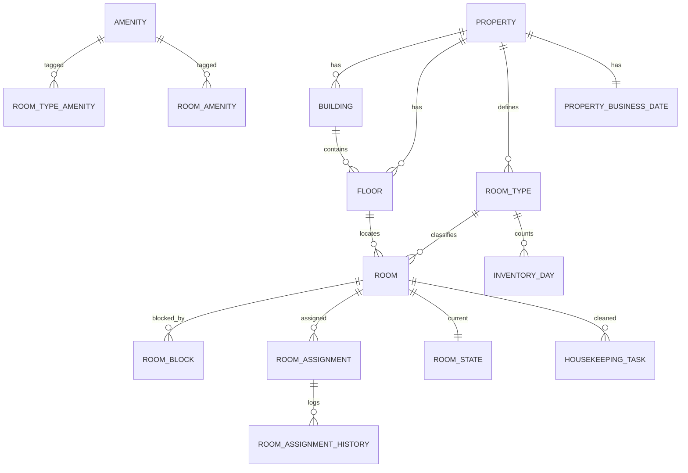
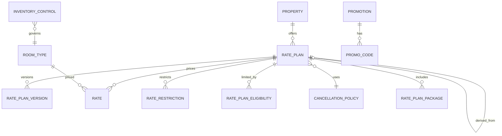
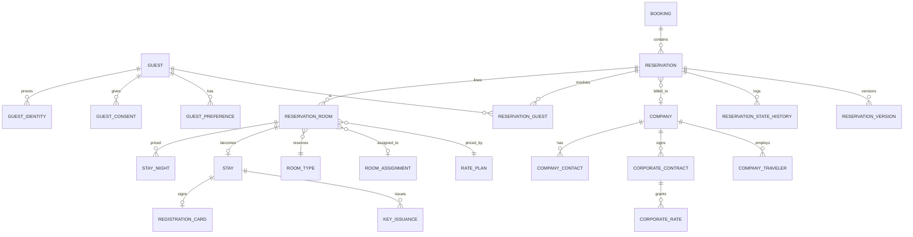
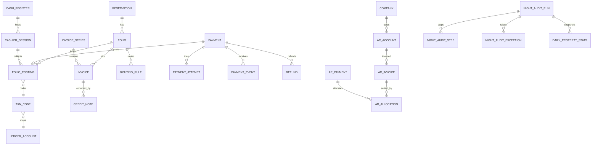
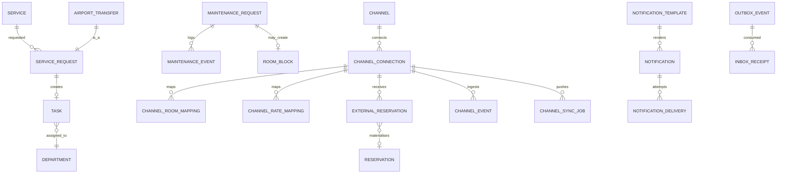

# 05 — Technical Architecture, Domains, ERD, API, Events, Integrations
Covers **AD–AI** (checklist items 24–29, 33–34 and the ERD).

---

## AD. Recommended Technical Architecture

### AD.1 Logical view

- **Deployables:** `api` (HTTP), `worker` (queues; scaled per queue group), web apps (Next.js), `migrator` (one-off task).
- **Sync vs async rule:** anything that changes inventory or ledger is synchronous in a DB transaction; anything that *reacts* (notify, sync to OTA, reports, HK task creation for non-critical) is async via outbox. **Exception:** HK tasks generated at checkout are created in the same transaction (operationally critical) — the notification about them is async.

### AD.2 Technology decisions (summary; see 08)
| Area | Choice | Notes |
|---|---|---|
| Monorepo | pnpm + Turborepo, TS strict | D-23 |
| API | NestJS (Fastify adapter), Zod → OpenAPI | D-10 |
| DB | PostgreSQL 16+ (RDS), Kysely/SQL migrations, extensions: `btree_gist`, `pgcrypto`, `pg_trgm`, `citext`, (`pg_partman` or manual partitions) | D-01, D-03 |
| Queue | Redis + BullMQ | D-09, D-15 |
| Web | Next.js (App Router), React, Tailwind, Radix, TanStack Query/Table/Virtual | D-13 |
| Mobile | Expo RN, expo-sqlite | D-12 |
| Object storage | S3 (SSE-KMS), presigned URLs, ClamAV/GuardDuty malware scan | |
| Email | SES; SMS/WhatsApp via provider adapters | |
| Observability | OpenTelemetry (ADOT collector) → CloudWatch/X-Ray (or Grafana stack), Sentry | |
| PDF generation | Headless Chromium worker (HTML→PDF, consistent branding/RTL) | invoices, registration cards |
| Testing | Vitest/Jest, Supertest, Testcontainers PG, Playwright, k6 | |
| IaC | Terraform, GitHub Actions (OIDC to AWS) | |
"Use current stable versions" — exact versions pinned at Phase 1 kickoff after verifying support matrices (Node LTS, Next.js, NestJS, Expo SDK, PostgreSQL 16/17).

### AD.3 Web architecture (item 33)
- `hotel-web`: authenticated shell; workspace = tenant → property switcher (persistent, keyboard `Ctrl+K` command palette: jump to reservation, guest, room; global search).
- **State/data:** TanStack Query with generated API client; optimistic UI only for safe operations; server-truth for money and inventory (mutations return authoritative data; conflict `409/412` handling with reload prompts).
- **Rack:** virtualised 2-D grid (rooms × dates), windowed API (`from`, `to`, `floors`, `types`), bars compressed; drag/drop is a *proposal* → server command → result; keyboard alternative for every drag action; SSE/polling invalidation.
- **Keyboard/UX:** documented hotkey map (F2 walk-in, F3 search, F5 check-in, F8 payment, F9 post charge…), inline editing, minimal modals (drawers/panels), autosave drafts, print-friendly CSS, tablet mode for registration signature.
- **Design system** `packages/ui`: tokens (colour, spacing, typography, status colours with colour-blind-safe variants), components (DataGrid, Rack primitives, StatusBadge, MoneyInput, DateRangePicker with business-date awareness, PermissionGate as *hint only*), RTL via logical CSS properties, dark mode, Urdu Nastaliq font stack, accessibility (WCAG 2.2 AA).
- **i18n:** ICU message format (`next-intl`/`formatjs`), extraction CI check, locale-aware money/date/number (Intl), Hijri optional; server-generated documents use the same catalogue.

### AD.4 Back-office architecture (item 34) — see AB.

---

## AE. Domain / Bounded-Context Architecture

Modules (NestJS) grouped in layers; **arrows = allowed dependencies** (via public service interface or event).


**Module responsibilities & owned data (excerpt):**
| Module | Owns | Publishes events | Consumes |
|---|---|---|---|
| Identity | user, credential, session, mfa, role, permission, role_assignment, api_client | UserInvited, RoleAssigned | — |
| Tenancy | tenant, legal_entity, brand, property_group | TenantCreated | — |
| Subscriptions | plan, subscription, entitlement, usage, platform_invoice | EntitlementChanged | RoomActivated, PropertyCreated |
| Properties/Rooms | property, building, floor, room_type, room, amenity, policy | RoomCreated/Changed | — |
| Inventory | inventory_day, room_block, room_assignment(+history), overbook rules | InventoryChanged, RoomAssigned/Changed, OversoldDetected | ReservationCreated…, MaintenanceBlock |
| Rates | rate_plan, rate_value, restriction, promo, package | RateChanged, RestrictionChanged | — |
| Reservations | booking, reservation, reservation_room, stay_night, state_history | ReservationCreated/Confirmed/Modified/Cancelled/NoShow | PaymentReceived |
| Guests | guest, identity, consent, preference, merge_log | GuestCreated/Merged | — |
| Companies/Corporate | company, contract, corp_rate, traveler, approval, ar_* | CorporateBookingApproved | ReservationCheckedOut |
| CheckIn | stay, registration_card, key_issuance, pre_checkin_submission | GuestCheckedIn, GuestCheckedOut | — |
| Folio | folio, posting, routing_rule, invoice, credit_note, tax_* usage | ChargePosted, InvoiceIssued | ServiceFulfilled, PaymentCaptured |
| Payments | payment, attempt, event, refund, settlement | PaymentReceived/Refunded | — |
| Cashier | register, session, drop, variance | CashierSessionClosed | PaymentCaptured |
| NightAudit | run, step, exception, daily_* snapshots | NightAuditCompleted, BusinessDateRolled | many |
| Housekeeping | hk_task, hk_status, assignment, inspection, lost_found | RoomMarkedDirty/Cleaned/Inspected | GuestCheckedOut, MaintenanceResolved |
| Maintenance | ticket, block link | RoomOutOfOrder/Restored | — |
| Services/Tasks | service, service_request, task | ServiceRequested/Fulfilled | — |
| Channels | connection, mappings, external_reservation, events, sync jobs | OTAReservationReceived | Inventory/Rate events |
| Notifications | template, delivery, preference | (delivery status) | domain events |
| Audit | audit_log, data_access_log | — | subscribes to commands via interceptor |
| Reports | definitions, jobs, exports | ReportReady | NightAuditCompleted |

**Boundary rules:** (1) one writer per table; (2) cross-module reads via query services, not joins on foreign tables (exception: reporting read models); (3) events carry IDs + minimal snapshot; (4) shared kernel limited to `Money`, `DateRange`, `BusinessDate`, `TenantContext`, `Result`, IDs.

---

## AF. Preliminary Database ERD

Conventions: UUIDv7 PKs; `tenant_id` on all tenant tables; `created_at/by`, `updated_at/by`, `version`; enums as `text` + `CHECK` (easier migration than PG enum); `tstzrange/daterange` where overlap matters; soft-delete only on master data.

### AF.1 Tenancy, subscription, identity

### AF.2 Property & inventory

### AF.3 Rates

### AF.4 Guests, companies, reservations

### AF.5 Folio, payments, cashier, audit

### AF.6 Operations, services, channels, platform


### AF.7 Critical constraint sketches
```sql
-- Physical room cannot be double-assigned
ALTER TABLE room_assignment ADD CONSTRAINT no_room_overlap
  EXCLUDE USING gist (room_id WITH =, stay_range WITH &&) WHERE (status IN ('ASSIGNED','IN_HOUSE'));

-- Tenant-consistent FKs
ALTER TABLE reservation_room ADD FOREIGN KEY (tenant_id, room_type_id) REFERENCES room_type (tenant_id, id);

-- One completed night audit per property/business date
CREATE UNIQUE INDEX one_audit_per_day ON night_audit_run (property_id, business_date)
  WHERE status IN ('RUNNING','COMPLETED');

-- One room charge per stay night (audit idempotency)
CREATE UNIQUE INDEX one_room_charge ON folio_posting (tenant_id, source_ref, txn_code_id)
  WHERE source_type = 'NIGHT_AUDIT';

-- Room numbers unique per property (active)
CREATE UNIQUE INDEX uq_room_number ON room (property_id, lower(number)) WHERE deleted_at IS NULL;

-- Outbox
CREATE TABLE outbox_event (id uuid PK, tenant_id, aggregate_type, aggregate_id, event_type, event_version, payload jsonb, created_at, published_at NULL);
```
Indexing baseline: every composite index leads with `tenant_id` (and `property_id` for operational tables); partial indexes for "active" rows; `(property_id, arrival_date)`, `(property_id, departure_date)` on reservation_room for arrivals/departures; GIN `pg_trgm` for name/phone fuzzy search; BRIN on time-series (audit, channel_event).

### AF.8 Additional entities beyond the brief — and why
| Entity | Why needed |
|---|---|
| `booking` | Group multiple property reservations (CRS/multi-property itinerary) & payer-level container |
| `reservation_room`, `stay_night`, `stay` | Multi-room bookings; per-night rate/tax snapshot; at check-in a stay differs from a booking |
| `reservation_version` | Immutable modification history (diffs, repricing) |
| `property_business_date` (or column) + `night_audit_step/exception` | Business date & resumable audit |
| `inventory_day` | Concurrency-safe counters (D-05) |
| `room_block` (OOO/OOS/house-use), `room_state` | Inventory effects of maintenance; stored occupancy/HK state |
| `txn_code`, `ledger_account`, `tax_*`, `routing_rule` | Financial classification, tax engine, multi-folio routing |
| `invoice`, `invoice_series`, `credit_note` | Legal documents, gapless numbering |
| `payment_attempt`, `payment_event`, `payment_proof`, `settlement_*` | Provider interaction, webhook dedupe, manual verification, reconciliation |
| `deposit_ledger` (view over postings) | Liability tracking |
| `cash_register`, `cash_drop`, `variance_review` | Cashier controls |
| `ar_account/invoice/payment/allocation`, `approval_*`, `cost_center` | Corporate receivables separated from guest folios |
| `cancellation_policy`, `deposit_policy` (versioned) | Policy snapshotting |
| `department`, `task` | Generic operational tasks (HK/maintenance/service/transport) |
| `lost_found`, `key_issuance`, `registration_card`, `pre_checkin_submission` | Front-desk/guest workflows |
| `guest_consent`, `data_retention_policy`, `dsar_request`, `data_access_log` | Privacy compliance |
| `guest_merge_log`, `blacklist_entry` | Data quality, risk control |
| `outbox_event`, `inbox_receipt`, `idempotency_key` | Reliable integration |
| `webhook_subscription`, `api_client`, `api_key` | Public API/partners |
| `notification_template/delivery/preference` | Multi-channel messaging with provider abstraction |
| `feature_flag`, `tenant_entitlement`, `room_count_snapshot` | Runtime plan gating & billing |
| `daily_*` snapshot tables | Immutable reporting |
| `support_access_grant` | Governed impersonation |
| `overbooking_rule`, `oversold_case` | Configurable overbooking & walk workflow |
| `document_asset` | Central file registry (S3 key, owner, classification, retention) |

---

## AG. API Architecture

- **Style:** REST/JSON, versioned by URL prefix `/v1` (additive changes only within version), OpenAPI 3.1 generated; separate namespaces: `/v1/…` (tenant staff), `/public/v1/…` (booking engine/guest), `/corporate/v1/…`, `/platform/v1/…`, `/webhooks/{provider}`.
- **Resource shape:** `/v1/properties/{propertyId}/reservations`, `/v1/reservations/{id}:confirm` (custom actions via `:verb` or `POST /…/actions/verb`) for state transitions — **commands, not PATCH of status**.
- **Tenant/property resolution:** tenant from authenticated principal only (never from a client-supplied header); property from path, validated against principal's scopes.
- **Pagination:** cursor-based (`limit`, `cursor`), stable ordering; `total` optional/expensive. **Filtering:** `filter[status]=…&filter[arrival][gte]=…`; **sorting:** `sort=-arrival_date,name`; **field selection** for heavy resources; **expand** whitelist.
- **Errors:** RFC 9457 `problem+json` with `type`, `code` (stable machine code e.g. `AVAILABILITY_CHANGED`, `INVALID_STATE_TRANSITION`, `PERMISSION_DENIED`, `LIMIT_EXCEEDED`), `detail`, `errors[]` (field-level), `correlationId`.
- **Validation:** Zod at the edge, domain validation inside services, DB constraints as last defence.
- **Idempotency:** `Idempotency-Key` required on POST for: reservations, payments, postings, refunds, check-in/out, night-audit steps, transfers, invoice issue. Stored `(tenant, key, method+path, request_hash, response, status, expires)`; same key + different payload ⇒ `422`; in-flight duplicate ⇒ `409` with retry-after.
- **Concurrency:** `ETag`/`If-Match` on mutable aggregates; `412` on mismatch.
- **Rate limits:** per IP, per user, per tenant, per API client; stricter on auth, public availability, webhooks; headers `RateLimit-*`.
- **AuthN/Z:** cookie sessions (web) / bearer tokens (mobile/API clients); every handler declares required permission + resource scope (decorator); deny-by-default; contract test asserts *every route has a permission decorator*.
- **Webhooks (outbound) P2:** signed (HMAC), retries with backoff, replay UI, event catalogue versioned.
- **Long operations:** `202 Accepted` + job resource (`/v1/jobs/{id}`) for reports, imports, audit runs.
- **Time:** ISO-8601; dates for stays are **property-local `date`** strings; instants in UTC with offset.
- **Money:** `{ "amount": "12500.00", "currency": "PKR" }` on the wire as string (no float), or `amountMinor` integer.
- **Deprecation policy:** `Sunset`/`Deprecation` headers; ≥12 months for public API.
- **Client SDK:** generated TS client with typed errors; mobile uses same.

---

## AH. Events & Background Jobs

### AH.1 Event catalogue (versioned, `{eventId, type, version, tenantId, propertyId, occurredAt, businessDate, actor, aggregate{type,id}, payload}`)
Reservation: `ReservationCreated`, `ReservationConfirmed`, `ReservationModified`, `ReservationCancelled`, `ReservationNoShow`, `ReservationReinstated`, `OptionExpired`
Room/Inventory: `RoomAssigned`, `RoomChanged`, `RoomBlocked`, `RoomBlockReleased`, `InventoryChanged`, `OversoldDetected`
Stay: `GuestCheckedIn`, `GuestCheckedOut`, `StayExtended`, `StayShortened`
Finance: `ChargePosted`, `PostingReversed`, `InvoiceIssued`, `PaymentReceived`, `PaymentFailed`, `RefundIssued`, `DepositReceived`, `CashierSessionClosed`
Housekeeping/Maint: `RoomMarkedDirty`, `RoomCleaned`, `RoomInspected`, `MaintenanceRequested`, `MaintenanceResolved`
Services: `ServiceRequested`, `ServiceFulfilled`, `AirportTransferStatusChanged`
Audit: `NightAuditStarted`, `NightAuditCompleted`, `BusinessDateRolled`
Corporate: `CorporateBookingRequested`, `CorporateBookingApproved`, `CorporateBookingRejected`, `CreditLimitBreached`
Channel: `OTAReservationReceived`, `ChannelSyncFailed`, `MappingChanged`
Platform: `SubscriptionChanged`, `EntitlementChanged`, `PropertyWentLive`

### AH.2 Delivery guarantees
Transactional outbox → relay (poll with `FOR UPDATE SKIP LOCKED`, batch, publish to BullMQ, mark published) → consumers idempotent via `inbox_receipt`. Ordering guaranteed per aggregate by using `aggregate_id` as BullMQ group key (or sequence number check). Poison messages → DLQ + alert.

### AH.3 Queues & jobs
| Queue | Jobs | Notes |
|---|---|---|
| `notifications` | render+send email/SMS/WhatsApp/push, delivery status webhooks | per-provider rate limits, retries, quiet hours |
| `channel-sync` (per provider) | ARI push, reservation poll, resync, verification | isolated concurrency & rate limits |
| `night-audit` | step execution, report generation | resumable, checkpointed |
| `reports` | async exports, scheduled reports | S3 outputs |
| `documents` | PDF render (invoice, registration card), image processing, malware scan | |
| `payments` | pending-payment sweeper, settlement import, webhook retry | |
| `maintenance` (scheduled) | inventory horizon extension, option expiry release, hold expiry, invariant checker, retention purge, token expiry, subscription usage snapshot, room-count snapshot, AR reminders | cron via BullMQ repeatable + DB leader check |
| `integrations` | outbound webhooks (P2), ERP push (P3) | |
Job standards: payload has `tenantId` + `correlationId`; worker sets tenant DB context; idempotent by design; exponential backoff; max attempts; DLQ; metrics (age, depth, failures) exposed.

---

## AI. Third-party Integration Architecture

**Pattern:** every external system = **port (interface in core) + adapter (integration module) + configuration (per tenant/property) + capability flags + health check + circuit breaker + test double**. Core operations never require an adapter to be online (no synchronous dependency on a provider inside critical transactions).

| Domain | Port | Candidates / notes | Verification needed |
|---|---|---|---|
| Payments | `PaymentProvider` | Pakistani bank-backed gateways, aggregator(s), JazzCash, Easypaisa, Raast-based flows; international card acquirers later | Merchant onboarding, sandbox, refund/void support, webhook signing, settlement files, fees, SBP/PSP regulations |
| Email | `EmailProvider` | AWS SES (+ fallback) | Domain auth (SPF/DKIM/DMARC) |
| SMS | `SmsProvider` | Local bulk-SMS aggregators / operator gateways in Pakistan (sender-ID/brand masking rules, PTA regulations, DND lists) | Regulatory registration, delivery reports |
| WhatsApp | `MessagingProvider(WHATSAPP)` | **Official WhatsApp Business Platform** via Meta Cloud API or an official BSP; template messages pre-approved; opt-in required; 24-hour service window rules | Meta business verification, template approval categories/pricing (current), BSP selection, number ownership per tenant vs platform (decision AV) |
| Push | `PushProvider` | FCM/APNs (Expo) | — |
| OTA | `ChannelProvider` | See 04 X | Partner programs |
| Smart lock | `DoorLockProvider` (`issueKey`, `revokeKey`, `listKeys`, `health`; key types PIN/QR/BLE/mobile) | Provider-neutral; first adapter chosen by customer demand | Vendor SDK/API, offline PIN generation, key-lifecycle SLAs |
| POS / F&B | `PosProvider` inbound API (`/pos/v1/charges`) + optional outbound menu sync | Third-party POS posts charges via signed API; posting validation (room, guest, status) | Local POS vendors |
| ERP/Accounting | `AccountingExporter` (journal export CSV in MVP-lite; API adapters P3) | QuickBooks, Xero, SAP, Oracle | GL account mapping, period locks, tax mapping |
| Flight info | `FlightStatusProvider` | Optional | Licensing cost |
| eKYC/OCR | `IdVerificationProvider` | NADRA-related verification requires regulated access — **do not assume availability** | Legal eligibility |
| Maps | Geocoding/maps for property & transfers | | |
| e-Invoicing/tax authority | `FiscalProvider` (jurisdiction pack) | Provincial/federal integration duties in Pakistan **to be verified** | Tax advisor |
| Storage/AV | S3 + malware scan | | |
| AI (P3) | `LlmProvider` | Tenant-isolated prompts, no training on tenant data, PII redaction | DPA/residency |

**Cross-cutting integration rules:** credentials in Secrets Manager (per-tenant envelope encryption for tenant-supplied keys); outbound egress through NAT with fixed IPs (allow-listing by providers); all webhooks verified, stored raw, deduped; contract tests against sandboxes/recorded fixtures in CI; adapter versioning; kill-switch per provider/tenant via feature flag; integration health dashboard.
