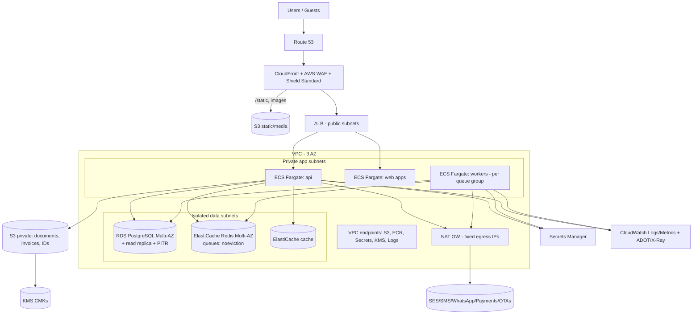

# 06 — Security, Tenant Isolation, AWS, DR, Observability, Cross-cutting Concerns
Covers **AJ–AM** (checklist items 30, 31) plus i18n, offline, performance and test strategy.

---

## AJ. Security & Tenant Isolation

### AJ.1 Tenant isolation — defence in depth (non-negotiable)
| Layer | Control |
|---|---|
| 1. Identity | Tenant derived **only** from the authenticated principal; never accepted from client input (headers/body/query) |
| 2. Request context | Per-request `TenantContext` (AsyncLocalStorage); repositories cannot be constructed without it; raw pool access banned by lint rule outside `db/` module |
| 3. Database RLS | `FORCE ROW LEVEL SECURITY` + policy on every tenant table; app role non-owner, no `BYPASSRLS`; `SET LOCAL app.tenant_id` in each transaction; a request without it sees **zero rows** |
| 4. Structural | Composite FKs `(tenant_id, id)`; no cross-tenant references possible |
| 5. Property scope | Second-level check: principal's property scopes vs row `property_id` (service-level + optional RLS variant using `app.property_ids`) |
| 6. Async | Queue payloads carry `tenantId`; workers set DB context before touching data; Redis keys prefixed `t:{tenant}:` |
| 7. Storage | S3 key prefix `tenants/{tenantId}/…`; access only via API-issued short-lived presigned URLs after authorization; bucket policy denies public access |
| 8. Caches/search | Tenant in cache key; no shared cache of tenant data without tenant dimension |
| 9. Logs/analytics/AI | Tenant tag on logs; analytics & AI use tenant-scoped credentials/semantic layer; no cross-tenant prompts or embeddings |
| 10. Ops | No shared admin DB user in app path; break-glass access approved/logged |

### AJ.2 Automated tenant-isolation tests (CI gates — mandatory)
1. **Schema lint:** iterate `information_schema`; every table with `tenant_id` must have RLS enabled+forced and a policy; every table *without* `tenant_id` must be on an explicit allow-list (reference data). CI fails otherwise.
2. **FK lint:** every FK between tenant tables must include `tenant_id`.
3. **Endpoint matrix test:** generated from OpenAPI — for every route with an ID parameter, seed Tenant A + B data; call as Tenant B with Tenant A's IDs ⇒ must return `404` (not 403, avoid existence leak) for reads/writes; list endpoints ⇒ zero A rows.
4. **Query fuzz:** run the ORM/query layer with no tenant context ⇒ returns nothing/throws.
5. **Queue test:** job for tenant A cannot read tenant B.
6. **Report/export test:** exports contain only tenant rows; cross-property scope respected.
7. **Signed URL test:** URL for tenant A object unusable by B; expiry enforced.
8. **Permission escalation suite:** cannot grant unheld permissions; cannot assign broader scope; role edit endpoints; IDOR on role assignments; mass-assignment on user updates.
9. **Static analysis:** semgrep rules for raw SQL without tenant predicate, missing permission decorator, `any` in auth code.
10. Periodic **external penetration test** (pre-launch and annually) including multi-tenant escape attempts.

### AJ.3 Authentication & sessions
- Argon2id; breach-password check; lockout/backoff; MFA (TOTP now, WebAuthn passkeys P2) **mandatory** for: platform staff, tenant owners/admins, finance roles, GM, and anyone with refund/adjust/role-manage permissions; **step-up** re-auth for refunds above limit, role changes, credential/bank-detail changes, exporting PII.
- Web: opaque server-side session ID in `__Host-` cookie (`HttpOnly; Secure; SameSite=Lax/Strict`), CSRF tokens for state-changing calls, idle + absolute timeouts (shorter for privileged), device list & remote revoke, concurrent session limits for cashier roles.
- Mobile/API: short-lived access token (≤15 min) + rotating refresh (reuse detection), device binding, biometric unlock.
- Guest/corporate: separate realms; OTP (phone/email) or password; magic links single-use, short-lived.
- Password reset/invite tokens single-use, hashed, short TTL; no user enumeration.

### AJ.4 Authorization
- Server-side, deny-by-default; `@RequirePermission('folio.adjust', {scope:'property'})`; central `AuthorizationService`; decision logging for denials; limits & approvals as in 01-E; **frontend permission checks are UX hints only**.
- Object-level checks (BOLA/IDOR): every read/write loads the resource *within* tenant+property scope.
- Rate-limit + anomaly alerts on privileged actions (e.g., many voids by one user).

### AJ.5 Data protection
| Data | Classification | Controls |
|---|---|---|
| Identity documents (CNIC, passport images) | **Restricted** | Envelope encryption (KMS CMK per environment + per-tenant data keys), stored in dedicated bucket, no public URLs, view requires permission + **reason** + logged in `data_access_log`, watermarked viewer, download disabled by default, auto-purge per retention policy, excluded from logs/exports/AI/backups where feasible |
| ID numbers (CNIC/passport no.) | Restricted | Field-level encryption; **blind index** (HMAC) for search/duplicate detection; UI masking (show last 4) |
| Guest contact, DOB, address | Confidential | Encrypted at rest (RDS KMS), masked exports, consent tracking, minimisation |
| Payment data | Restricted | **No PAN/CVV stored** (hosted fields/redirect; SAQ-A), tokens only; provider secrets in Secrets Manager; PII in payment logs redacted |
| Financial ledgers | Confidential/integrity-critical | Append-only, DB privileges, backups, restricted access |
| Corporate contracts/rates | Confidential | Company-scoped access; rate visibility rules |
| Audit logs | Integrity-critical | Append-only; optional hash chain; S3 Object Lock export |
- **Retention & erasure:** configurable per tenant/jurisdiction (e.g., ID images purged N days after checkout unless legally retained; financial records retained per tax law); **erasure = anonymise** guest PII while keeping ledger integrity; DSAR export tooling; consent versioning.
- **Encryption in transit:** TLS 1.2+ everywhere, HSTS, internal TLS to RDS/Redis; **at rest:** KMS for RDS, S3, EBS, ElastiCache, backups, secrets.

### AJ.6 Application security (OWASP)
| Risk | Mitigation |
|---|---|
| A01 Broken access control | Scope-aware authz, BOLA tests, deny-by-default, RLS |
| A02 Cryptographic failures | Managed keys, no custom crypto, Argon2id, TLS |
| A03 Injection | Parameterised queries only; typed query builder; input validation (Zod); output encoding; CSP; PDF generation sandboxed (no remote fetch, template escaping) |
| A04 Insecure design | Threat modelling per epic (STRIDE); abuse-case tests; state machines server-enforced |
| A05 Misconfiguration | Terraform baselines, CIS benchmarks, security headers (CSP, HSTS, X-Content-Type-Options, Referrer-Policy, Permissions-Policy, frame-ancestors) — widget iframe allowed only for configured domains |
| A06 Vulnerable components | Renovate/Dependabot, `pnpm audit`, SBOM, image scanning (ECR), pinned lockfile, provenance |
| A07 Auth failures | MFA, throttling, session hygiene |
| A08 Integrity failures | Signed webhooks, CI provenance, migration review, immutable ledgers |
| A09 Logging failures | Structured audit + security events, alerting |
| A10 SSRF | Outbound webhook/URL fetch through allow-list proxy; block metadata IP; no user-supplied URL fetch in PDF/render |
| File uploads | MIME sniffing, size limits, AV scan, image re-encoding/EXIF strip, random keys, separate domain for user content |
| Rate limiting / DoS | WAF managed rules + rate rules, per-tenant quotas, request size limits, timeouts, bulkheads, queue backpressure |
| Bot/scraping (booking engine) | WAF bot control, CAPTCHA on holds, per-IP quotas |
| Insider threat | Segregation of duties, audit, alerts, break-glass with notification |
| Secrets | AWS Secrets Manager/SSM, rotation, no secrets in env files/repo, secret scanning in CI |
| Supply chain (CI/CD) | GitHub OIDC to AWS (no long-lived keys), branch protection, required reviews, signed images |

### AJ.7 Audit trail
- **What:** reservation changes, rate changes, room moves, discounts, comps, payments, refunds, folio adjustments/transfers, check-in/out, night audit steps, permission/role/MFA changes, corporate credit changes, mapping changes, config changes, exports, impersonation.
- **Record:** `{id, tenant, property, actor{type,id,onBehalfOf}, action, resource{type,id}, before, after, reason_code, note, ip, user_agent/device, request_id, occurred_at}`.
- Implementation: command-level interceptor + explicit domain audit calls for financial events; before/after computed from domain snapshot diffs; PII fields redacted/hashed in diffs; monthly partitions; read API with permissions; export to S3 Object Lock.
- **Alerting rules:** discounts above X, void/reversal spikes, after-hours refunds, mass exports, privilege changes, failed MFA bursts, cross-tenant access attempts (should be 0).

### AJ.8 Threat model highlights (mission-critical domains)
| Domain | Top threats | Controls |
|---|---|---|
| Availability | Race conditions, replayed requests, hold exhaustion, mapping errors | D-05 atomic counters + exclusion constraints; idempotency; hold caps; mapping gate |
| Folio | Void-after-cash, unauthorised discount, backdating, ledger edit | Immutable postings, limits/approvals, business-date lock, reversals reports |
| Payments | Webhook spoofing/replay, amount tampering, redirect-based false success | Signature verify, dedupe, amount check, server-side status confirmation |
| Night audit | Double run, partial failure, duplicate room charges | Unique constraints, CAS roll, step ledger |
| Tenant isolation | IDOR, missing filter, job context leakage, cache poisoning | Layers AJ.1 + tests AJ.2 |
| PII | Bulk download, insider browsing, backup leak | Access reasons/logs, masking, encryption, retention |

---

## AK. AWS Infrastructure

### AK.1 Region choice
See D-16. Decision needed (AV). Design is region-parametric in Terraform.

### AK.2 Topology (per environment: dev / staging / prod, separate AWS accounts via Organizations)

| Component | Detail |
|---|---|
| Compute | ECS Fargate (no Kubernetes — team size/scale doesn't justify; revisit at sustained large scale or for GPU/AI) ; autoscaling on CPU/RPS/queue depth; separate task defs for `api`, `worker-*`, `web-*`, `migrator`; graceful shutdown; blue/green via CodeDeploy or rolling with health gates |
| DB | RDS PostgreSQL Multi-AZ, gp3/io2, PITR 7–35 days, encryption, Performance Insights, parameter group tuned; **PgBouncer** (transaction mode) sidecar/service or RDS Proxy (verify `SET LOCAL` semantics — compatible in transaction mode); read replica for reports; automated minor upgrades in maintenance window; connection limits per service |
| Redis | Two logical instances: **queue** (Multi-AZ, AOF/persistence, `noeviction`) and **cache/rate-limit** (LRU) |
| Storage | S3 buckets: `media` (public via CloudFront OAC), `documents` (private, KMS, Object Lock optional for audit exports), `exports`; lifecycle rules; versioning; access logs; block public access; malware scan (GuardDuty for S3 or ClamAV Lambda) |
| Edge | CloudFront (custom domains for booking engine/corporate portal via ACM), WAF (AWS managed rules, bot control, rate rules, geo rules as needed) |
| Email | SES (dedicated IPs later), bounce/complaint handling via SNS→queue |
| Secrets/keys | Secrets Manager (rotation), KMS CMKs (separate for DB, S3-docs, secrets), IAM least privilege task roles |
| Registry/CI | ECR (scan on push, immutable tags), GitHub Actions with OIDC; Terraform plan/apply pipelines with approvals; drift detection |
| Observability | CloudWatch Logs (JSON), metrics, alarms, X-Ray/ADOT traces, Sentry; optional Grafana/Prometheus later |
| Security services | GuardDuty, Security Hub, Config, CloudTrail (org trail → locked S3), Inspector for ECR, IAM Access Analyzer, VPC Flow Logs |
| Network | 3 AZ, private subnets for compute/data, no public DB, SGs least-privilege, egress via NAT with fixed EIPs (provider allow-listing) |
| Cost controls | Fargate Spot for non-critical workers (reports), right-sizing, S3 lifecycle, budgets/alerts, tag by env/module |
| Terraform | Modules: network, ecs-service, rds, redis, s3-secure-bucket, cloudfront-waf, observability, iam-baseline; remote state (S3+lock), workspace per env, `tfsec/checkov` in CI |

### AK.3 Environments & release
`dev` (ephemeral preview envs optional) → `staging` (prod-like, anonymised data, provider sandboxes) → `prod`. Trunk-based development, feature flags, DB migrations **expand/contract** (backward-compatible), automated smoke + Playwright on staging, canary/blue-green, one-click rollback (code) — DB rollbacks via forward fixes.

### AK.4 Scalability envelope (design targets)
| Metric | Target | Notes |
|---|---|---|
| Tenants | 5k small tenants → 500 mid | Pooled DB + RLS |
| Properties | 10k | |
| Rooms | 300k | ~100+ M inventory rows/yr at 730-day horizon — partition `inventory_day` by property hash/time if needed |
| Peak booking writes | tens/s/property group; ~100s/s platform | Row-level atomic updates scale fine |
| Folio postings | ~100M/yr | Partition by business_date (monthly) after ~1 yr |
Load-test with k6 at 3× projected before launch.

---

## AL. Backup & Disaster Recovery

| Asset | Strategy | RPO / RTO target (initial) |
|---|---|---|
| PostgreSQL | Multi-AZ synchronous standby (AZ failure ⇒ auto failover ~60–120 s); automated backups + **PITR**; daily snapshots copied cross-region (and cross-account) ; monthly restore drill | RPO ≤ 5 min; RTO ≤ 1 h (AZ), ≤ 4 h (region) |
| S3 documents | Versioning + cross-region replication for `documents`; Object Lock for audit exports | RPO ≈ minutes |
| Redis | Non-authoritative; queues rebuilt from DB (outbox/sync jobs re-enqueue) | RTO minutes |
| Config/Terraform | Git + remote state versioned | — |
| Secrets/KMS | Multi-region keys/replicated secrets for DR | — |
| Region failure (P2/P3) | Warm-standby: cross-region read replica + IaC-provisioned stack (pilot-light); DNS failover runbook; tested twice yearly | RTO ≤ 4–8 h |
- **Tenant-level restore:** PITR restores the whole cluster; per-tenant recovery = restore to side instance → extract tenant rows (tooling: tenant export/import scripts, maintained & tested) → reconcile.
- **Data integrity checks post-restore:** run invariant checker (inventory, folio balances).
- **Hotel downtime procedure ("contingency pack")**: printable/PDF arrivals, in-house, room status, balances auto-emailed (hourly/at audit) + cached on devices; manual registration forms & receipts with pre-numbered sequences; "backfill" screens with reason codes when service resumes; Night audit continuity rule: audit cannot run until backfill complete or manager attests.
- **Runbooks:** DB failover, region failover, Redis loss, provider outage (payments/OTA/WhatsApp), suspected breach, tenant data-leak response (72-hour notification workflow as applicable), corrupted inventory counters (invariant repair), duplicate night audit.
- **Backup retention:** 35-day PITR; monthly snapshots 12 months; legal hold capability; deletion of tenant data honours retention policy (backups age out — documented).

---

## AM. Observability

| Pillar | Implementation |
|---|---|
| Logs | JSON (pino), fields: `ts, level, service, env, tenantId, propertyId, userId(hash), correlationId, traceId, route, latency, outcome`; PII scrubbing; log sampling for noisy paths; retention 30–90 d (audit is separate) |
| Correlation | `X-Correlation-Id` accepted/generated at edge, propagated to queues/jobs/webhooks/logs/audit |
| Traces | OpenTelemetry SDK (HTTP, PG, Redis, BullMQ, outbound provider calls) → ADOT → X-Ray/Tempo |
| Metrics | RED per endpoint; DB (pool wait, slow queries, locks), queue depth/age/failures, outbox lag, channel sync lag/success by provider, payment webhook latency/failure, night audit duration/exceptions, notification delivery rates, inventory drift count, business KPIs (bookings/min) |
| Errors | Sentry (web, api, workers, mobile) with release tracking, tenant tag |
| Health | `/healthz` (liveness), `/readyz` (DB, Redis, migrations), synthetic checks: booking flow canary on staging + prod-safe canary tenant |
| Alerts (SLO-based) | API availability 99.9%, p95 latency (search < 500 ms, reservation create < 800 ms, rack window < 700 ms), error budget burn; **business alerts**: outbox lag > 60 s, channel sync backlog > N min, night-audit failed/stuck, negative availability, folio balance ≠ postings, webhook failures, unusual discounts/refunds, queue DLQ non-empty |
| Dashboards | Platform health; queues; per-provider integration; night audit monitor; tenant usage/entitlement; DB |
| Runbook links | Each alert links to runbook |
| Incident mgmt | On-call rotation (from beta), severity matrix, status page, post-mortems |

---

# Cross-cutting concerns

## Internationalisation & localisation
- UI strings via ICU catalogues; **RTL-ready from day one** (CSS logical properties, mirrored components, bidi-safe formatting); English shipped in MVP; Urdu (Nastaliq-capable fonts, digits policy) in P2; Arabic P3.
- Locale-aware **money/date/number/phone** formatting; multi-calendar display optional.
- **Time:** timestamps `timestamptz` UTC; property timezone on `property`; stay dates `date` in property-local; business date `date`; DST-safe by using dates for stays and instants for events; conversions only at edges.
- **Documents/notifications** templates per locale with fallbacks; guest language preference on profile.
- **Currency:** ISO-4217 table with exponent; PKR default; multi-currency later via FX tables and dual amounts (reserved columns). Accept USD for foreign guests through explicit tender + FX rate at payment time (P2, manual rate table).
- **Jurisdiction packs:** tax, invoice layout, mandatory guest fields, police/authority exports, holiday calendars, weekend definition (Pakistan weekend Fri/Sat-Sun conventions differ by hotel — configurable, not assumed), Ramadan/Eid seasons templates.

## Offline / degraded-mode strategy (detail on D-17)
| Workflow | MVP | P2 | P3 |
|---|---|---|---|
| Front-desk view (arrivals, in-house, room status, balances) | Contingency PDF/print pack; browser-cached last snapshot | PWA read-only offline with last-sync stamp | Local edge node for large hotels |
| Check-in/out, reservations, payments | **Not offline** (paper procedure + backfill) | Offline *check-in intent capture* (registration + ID photos queued, applied on reconnect after server validation) — evaluate demand | Edge node with local authoritative inventory for a property (complex; only if justified) |
| Housekeeping/maintenance mobile | Local queue, idempotent commands | + photo sync, conflict UI | — |
| Night audit | Server-only; pre-audit "backfill attestation" | — | — |
| Guest app | Cached reservation info | — | — |
**Connectivity resilience also includes:** UI resilience (retry with idempotency keys, no double-submit), slow-network budget (< 200 KB JS per route target for hot screens), 4G/3G-friendly payloads, dual-ISP guidance, UPS/power guidance in onboarding.

## Performance strategy
- Small property (10 rooms) → sub-200 ms typical interactions; group (thousands of rooms) → windowed queries.
- **Never load full history:** cursor pagination, date windows, virtualised grids, server-side aggregation.
- **Indexes** leading with `tenant_id, property_id`; partial indexes; covering indexes on rack query; `EXPLAIN` budgets in CI for hot queries.
- **Rack query design:** one query for rooms (cached per property), one query for `stay` bars overlapping `[from,to)` using range operator (GiST/`daterange` index), one for blocks; payload compact arrays; incremental fetch when scrolling; ETag for revalidation.
- **Caching:** reference data (room types, rate plans, permissions) in Redis/in-process with event-based invalidation; **no caching of write-path availability**.
- **Write contention:** hot `inventory_day` rows handled by short transactions; retry on serialization/deadlock with jitter; batched multi-night operations sorted by key.
- **Search:** trigram indexes for guest names/phones; blind-index exact matching for IDs; consider OpenSearch only if needed (P3).
- **Load tests:** k6 scenarios (peak arrivals, booking-engine bursts, night audit on 500 rooms, channel storms).

## Testing strategy
| Layer | Scope | Tooling |
|---|---|---|
| Unit | Domain rules: rate engine, tax engine, state machines, availability math, policies, money | Vitest; property-based (fast-check) for rate/tax/availability invariants |
| Integration | Repos + real PostgreSQL (Testcontainers), RLS, constraints, outbox, idempotency | Vitest/Jest |
| **Concurrency** | N parallel bookings for last room ⇒ exactly one wins; parallel move/extend; duplicate webhook; duplicate audit run | Real DB, worker threads |
| API/contract | OpenAPI conformance, permission-decorator coverage, tenant-matrix | Supertest, Schemathesis-style |
| E2E web | Walk-in, reservation→check-in→folio→checkout→audit, corporate flow, rack drag/drop w/ conflict | **Playwright** |
| Mobile | HK flow, offline queue | Detox/Maestro |
| Security | Isolation suite, escalation suite, SAST/DAST, dependency scan | Semgrep, ZAP |
| Non-functional | Load, soak, chaos (kill worker mid-audit, Redis flush, provider 500s) | k6, custom |
| Data integrity **invariant checks** (also run in production nightly) | inventory counters = reservations; folio cached balance = Σpostings; every occupied night has room charge; no overlapping assignments; cashier expected = postings; payments captured have postings | scheduled job → alerts |
| Financial scenario tests | Golden files: multi-tax invoices, split folio, refund partial, corporate credit & WHT, cancellation fee under policy versions, night-audit rerun | fixtures |
**Mandatory scenario list from brief** (double booking, concurrent reservation, room move, extension, rate change, check-in, checkout, folio split, charge transfer, refund, corporate credit, night audit rerun, duplicate OTA event, OTA cancellation, tenant isolation, permission escalation, payment webhook duplication) — each has a named test in the plan with owner and CI gate.
- **Quality gates:** coverage on domain modules ≥ 85% lines/branches for money/inventory; mutation testing on rate/tax engines (Stryker) in nightly.
